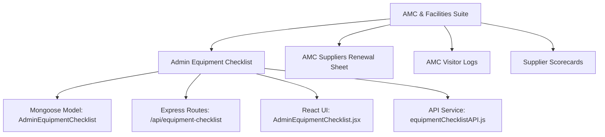

# Admin Equipment Maintenance Checklist Module Documentation

## 1. Overview & Purpose

The **Admin Equipment Maintenance Checklist** module is an administrative and facility management solution within the **AlVision Exim** platform. It provides a standardized, paperless, and auditable system for facilities and administrative teams to:
- Conduct regular, scheduled inspections of essential office equipment and premises.
- Monitor cleanliness, operational readiness, and physical condition.
- Identify and flag malfunctioning assets requiring vendor maintenance or repairs.
- Maintain photo evidence and historical audit logs of all facility checks.
- Connect facility items with contracted **AMC (Annual Maintenance Contract)** service providers.

---

## 2. Module Ecosystem & Architecture

The module belongs to the **AMC & Facility Management** module suite:



### File Map

| Layer | File Path | Description |
| :--- | :--- | :--- |
| **Model** | [`server/model/adminEquipmentChecklistModel.mjs`](file:///c:/eximdev/server/model/adminEquipmentChecklistModel.mjs) | MongoDB schema for checklist submissions and item line-items |
| **Routes** | [`server/routes/amc-renewals/adminEquipmentChecklistRoutes.mjs`](file:///c:/eximdev/server/routes/amc-renewals/adminEquipmentChecklistRoutes.mjs) | Express REST endpoints for CRUD operations |
| **App Mount** | [`server/app.mjs`](file:///c:/eximdev/server/app.mjs#L730) | Mounts routes at `/api/equipment-checklist` |
| **API Client** | [`client/src/api/equipmentChecklistAPI.js`](file:///c:/eximdev/client/src/api/equipmentChecklistAPI.js) | Axios client helper methods |
| **React UI** | [`client/src/pages/AdminEquipmentChecklist.jsx`](file:///c:/eximdev/client/src/pages/AdminEquipmentChecklist.jsx) | Full dashboard, modal submission form, image previewer & detail viewer |
| **Navigation** | [`client/src/utils/navigateToModule.js`](file:///c:/eximdev/client/src/utils/navigateToModule.js#L71) | Maps module name to route `/equipment-checklist` |
| **Permissions** | [`client/src/pages/ProtectedRoute.js`](file:///c:/eximdev/client/src/pages/ProtectedRoute.js) | Access control & route protection (strictly requires Admin module assignment) |

---

## 3. Database Schema

Defined in [`server/model/adminEquipmentChecklistModel.mjs`](file:///c:/eximdev/server/model/adminEquipmentChecklistModel.mjs).

### Parent Document: `AdminEquipmentChecklist`

```javascript
{
  checkedBy: { type: String, required: true },
  date: { type: Date, default: Date.now },
  items: [adminEquipmentChecklistItemSchema],
  createdAt: Date,
  updatedAt: Date
}
```

### Subdocument: `adminEquipmentChecklistItemSchema`

| Field | Type | Options / Constraints | Description |
| :--- | :--- | :--- | :--- |
| `equipmentName` | `String` | Required | Name of the equipment/facility area |
| `assetId` | `String` | Optional (default: `""`) | Internal tag or asset code |
| `location` | `String` | Optional (default: `""`) | Floor / office zone (e.g., First Floor, Second Floor) |
| `condition` | `String` | Enum: `["Good", "Fair", "Poor", ""]` | Physical condition rating |
| `cleaningDone` | `String` | Enum: `["Yes", "No", ""]` | Whether cleaning/sanitization was completed |
| `functionalCheck`| `String` | Text (e.g., `"OK"`, `"Not OK"`) | Operational health status |
| `repairRequired`| `String` | Enum: `["Yes", "No", ""]` | Flag indicating repair or servicing need |
| `amcVendor` | `String` | Optional (default: `""`) | Servicing vendor name |
| `remarks` | `String` | Optional (default: `""`) | Free-text notes or issue explanation |
| `image` | `String` | Optional (default: `null`) | Base64-encoded image data URL |

---

## 4. REST API Reference

Base Path: `/api/equipment-checklist`

### 1. List Checklists
- **Method**: `GET`
- **Path**: `/api/equipment-checklist`
- **Query Parameters**:
  - `search` *(string, optional)*: Case-insensitive search across `checkedBy`, `items.equipmentName`, and `items.amcVendor`.
  - `page` *(number, optional, default: 1)*: Pagination page number.
  - `limit` *(number, optional, default: 50)*: Number of records per page.
- **Response**:
```json
{
  "success": true,
  "data": [ /* Array of AdminEquipmentChecklist documents */ ],
  "total": 12,
  "page": 1,
  "totalPages": 1
}
```

### 2. Get Single Checklist by ID
- **Method**: `GET`
- **Path**: `/api/equipment-checklist/:id`
- **Response**:
```json
{
  "success": true,
  "data": { /* Full AdminEquipmentChecklist document */ }
}
```

### 3. Create Checklist Entry
- **Method**: `POST`
- **Path**: `/api/equipment-checklist`
- **Request Body**:
```json
{
  "checkedBy": "admin_user",
  "date": "2026-09-02T00:00:00.000Z",
  "items": [
    {
      "equipmentName": "Water Dispenser / RO",
      "assetId": "RO-002",
      "location": "First Floor",
      "condition": "Good",
      "cleaningDone": "Yes",
      "functionalCheck": "OK",
      "repairRequired": "No",
      "amcVendor": "AquaTech Services",
      "remarks": "Filters replaced last week",
      "image": "data:image/jpeg;base64,..."
    }
  ]
}
```
- **Response Status**: `201 Created`

### 4. Delete Checklist Entry
- **Method**: `DELETE`
- **Path**: `/api/equipment-checklist/:id`
- **Response**:
```json
{
  "success": true,
  "message": "Checklist deleted successfully"
}
```

---

## 5. Frontend Features & User Interface

Implemented in [`client/src/pages/AdminEquipmentChecklist.jsx`](file:///c:/eximdev/client/src/pages/AdminEquipmentChecklist.jsx).

### Standard Default Equipment Template
When creating a new checklist, the system automatically pre-populates default inspection line-items:
1. **Washroom**
2. **Water Dispenser / RO**
3. **Refrigerator / Microwave Oven**
4. **Biometric Device**
5. **Fire Extinguisher**

### Core UI Capabilities
1. **Search & Filter Table**:
   - Filter records instantly by checker name or equipment keyword.
   - Shows inspection date, checker, item count, and health summary badge (`All OK` in green or `X Device(s) Repair Required` in amber/red).
2. **Standardized Entry Form**:
   - Inspector name (defaults to logged-in user) and date selector.
   - Inline controls per item for Location, Condition, Cleaning Done, Functional Check, Repair Required, and AMC Vendor.
3. **Client-Side Image Processing**:
   - Uses browser `FileReader` API to encode camera/gallery uploads into Base64 format.
   - No external third-party CDN or cloud upload dependency required.
4. **Detail & Image Preview Modals**:
   - **View Details**: Summary KPI cards (Date Checked, Checked By, Total Repairs Required) and highlighted rows for flagged equipment.
   - **Image Preview**: Full-screen modal for image inspection.

---

## 6. Access Control & Navigation

- **Module Key**: `"Admin Equipment Checklist"`
- **Parent Category**: `"AMC Suppliers Renewal Sheet"` (see [`moduleCategories.js`](file:///c:/eximdev/client/src/utils/moduleCategories.js#L36))
- **Route**: `/equipment-checklist`
- **Permissions**: Configurable per role/user in [`AssignModule.js`](file:///c:/eximdev/client/src/components/home/AssignModule.js) and validated by [`ProtectedRoute.js`](file:///c:/eximdev/client/src/pages/ProtectedRoute.js).
