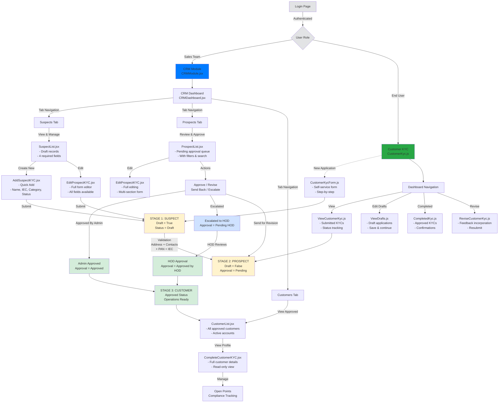
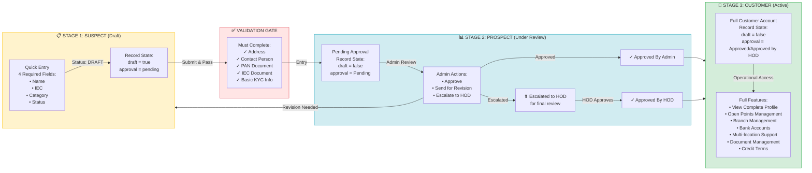
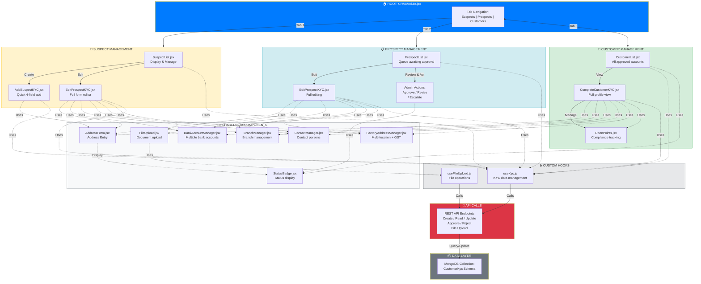

# CRM UI Flow & Architecture Documentation

## 1. CRM UI Flow & Pipeline Architecture

---

## 2. CRM Pipeline: 3-Stage Conversion Flow with Validation

---

## 3. CRM Component Architecture & Data Flow

---

## Summary Tables

### CRM Stages Overview

| Stage | Name | Status | Key Characteristics |
|-------|------|--------|-------------------|
| 1 | **SUSPECT** | Draft | 4 required fields only, `draft = true` |
| 2 | **PROSPECT** | Pending Approval | Validation gates passed, awaiting admin review |
| 3 | **CUSTOMER** | Approved | Full access, operations ready |

### Component Files & Locations

| Component | File Path | Purpose |
|-----------|-----------|---------|
| Main Module | `client/src/components/crm/CRMModule.jsx` | Entry point with tab navigation |
| Dashboard | `client/src/components/crm/CRMDashboard.jsx` | Pipeline overview & metrics |
| Suspect List | `client/src/components/crm/SuspectList.jsx` | Display drafted leads |
| Add Suspect | `client/src/components/crm/AddSuspectKYC.jsx` | Quick 4-field entry |
| Prospect List | `client/src/components/crm/ProspectList.jsx` | Approval queue |
| Edit Form | `client/src/components/crm/EditProspectKYC.jsx` | Full multi-section editor |
| Customer List | `client/src/components/crm/CustomerList.jsx` | Approved customers |
| Customer View | `client/src/components/crm/CompleteCustomerKYC.jsx` | Full profile view |

### Validation Gates

Records must pass these validation rules to move from **Suspect → Prospect**:

- ✅ **Address**: Permanent OR Principal address required
- ✅ **Contact Person**: Name, Designation, Phone, Email
- ✅ **PAN Document**: Uploaded & verified
- ✅ **IEC Document**: Uploaded & verified
- ✅ **Basic KYC Info**: All mandatory fields completed

### Approval Workflow

1. **Admin Review**: Can approve or send for revision
2. **HOD Escalation**: For high-value or complex cases
3. **Final Approval**: Either admin or HOD authorization required
4. **Revision Loop**: Send back to prospect stage for corrections

### Key Features by Stage

#### Suspect Stage
- Quick entry with 4 fields
- Draft save functionality
- Can edit before submission

#### Prospect Stage
- Multi-section detailed form
- Document attachment
- Admin review & decision making
- Escalation options

#### Customer Stage
- Read-only complete profile
- Open points management
- Multi-location support
- Bank account management
- Document history
- Credit terms & limits

---

## User Interfaces

### Sales Team Interface (CRM Module)
- Access: `CRMModule.jsx`
- Views: Dashboard → Suspects → Prospects → Customers
- Actions: Create, Edit, Approve, Escalate, Track

### Customer Interface (KYC Portal)
- Access: `CustomerKyc.js`
- Views: Dashboard → Forms → Submissions → Status
- Actions: Apply, Draft, Edit, Resubmit, Track Status
