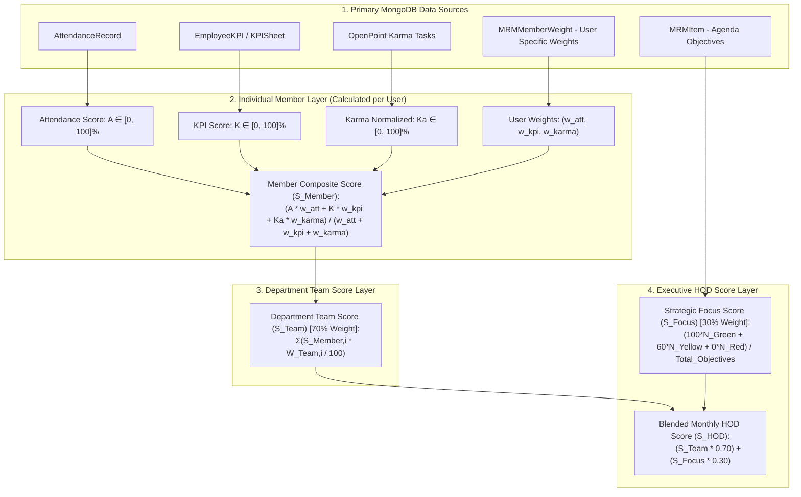

# MRM Scoring & Mathematical Calculation Guide

This document outlines the complete mathematical formulation, calculation logic, database mapping, and dynamic execution flow for the **Management Review Meeting (MRM) & HOD Performance Scoring System**.

---

## 1. Architectural Calculation Hierarchy

---

## 2. Layer 1: Raw Performance Metric Ingestion

Every score originates from live employee records for the target calendar month (`year`, `month`):

### A. Attendance Score ($A$)
Measures the ratio of days worked against total expected working days in the month.

$$\text{Present Equivalent Days} = D_{\text{present}} + D_{\text{on\_duty}} + D_{\text{leave}} + D_{\text{late}} + 0.5 \times (D_{\text{half\_day}} + D_{\text{missed\_punch}})$$

$$\text{Working Days} = \text{Calendar Days in Month} - (\text{Weekly Offs} + \text{Gazetted Holidays})$$

$$A = \begin{cases} 
\min\left(100, \max\left(0, \left(\frac{\text{Present Equivalent Days}}{\text{Working Days}}\right) \times 100\right)\right), & \text{if } \text{Working Days} > 0 \text{ and records exist} \\ 
100, & \text{otherwise (clean slate)} 
\end{cases}$$

* **Source Collection**: `AttendanceRecord` (`year_month: "YYYY-MM"`, `employee_id: userId`)
* **Rounding**: 1 decimal place (`.toFixed(1)`)

---

### B. KPI Score ($K$)
Measures task and performance delivery against departmental Key Performance Indicators.

$$K = \begin{cases}
\min\left(100, \max\left(0, \text{total\_kpi\_score} \times 10\right)\right), & \text{from } \text{EmployeeKPI (score out of 10)} \\
\min\left(100, \max\left(0, \text{overall\_percentage}\right)\right), & \text{from } \text{KPISheet.summary} \\
100, & \text{if sheet is } \text{APPROVED / VERIFIED without score} \\
0, & \text{otherwise}
\end{cases}$$

* **Source Collections**: `EmployeeKPI` (`year`, `month`, `employee`), `KPISheet` (`user`, `month`, `year`)
* **Rounding**: 1 decimal place (`.toFixed(1)`)

---

### C. Karma Points & Karma Normalized Score ($Ka$)
Measures problem-solving agility, accountability, and on-time task delivery through the Open Points system.

Each Open Point carries priority-weighted points:
* **Critical / Urgent**: 3 Points
* **High**: 2 Points
* **Medium / Low**: 1 Point

$$\text{Green Pts} = \sum_{\text{Status = 'Green'}} \text{Priority Points}$$
$$\text{Red Pts} = \sum_{\text{Status = 'Red'}} \text{Priority Points}$$
$$\text{In-Progress Pts} = \sum_{\text{Status } \in \{\text{'Yellow'}, \text{'Orange'}\}} \text{Priority Points}$$

$$\text{Net Karma Points} = \text{Green Pts} - \text{Red Pts}$$

$$Ka = \begin{cases}
\min\left(100, \max\left(0, \text{round}\left(\frac{\text{Green Pts}}{\text{Green Pts} + \text{Red Pts} + \text{In-Progress Pts}} \times 100\right)\right)\right), & \text{if Total Task Points} > 0 \\
100, & \text{if employee has 0 open points}
\end{cases}$$

* **Source Collection**: `OpenPoint` (`responsible_person: userId`)
* **Display**: Shows net points ($+5\text{ pts}$ or $-2\text{ pts}$) alongside normalized percentage ($Ka\%$).

---

## 3. Layer 2: Individual Member Composite Score ($S_{\text{Member}}$)

Each team member has **independent, individually configurable component weights**:
* $w_{\text{att}}$ = Member Attendance Weight % (e.g. 34%)
* $w_{\text{kpi}}$ = Member KPI Weight % (e.g. 33%)
* $w_{\text{karma}}$ = Member Karma Weight % (e.g. 33%)

$$\text{Weight Total } (W_{\text{comp}}) = w_{\text{att}} + w_{\text{kpi}} + w_{\text{karma}}$$

$$S_{\text{Member}} = \left( A \times \frac{w_{\text{att}}}{W_{\text{comp}}} \right) + \left( K \times \frac{w_{\text{kpi}}}{W_{\text{comp}}} \right) + \left( Ka \times \frac{w_{\text{karma}}}{W_{\text{comp}}} \right)$$

### Role-Based Measurement Examples:
1. **Standard Executive / Coordinator**:
   * Weights: Attendance = $34\%$, KPI = $33\%$, Karma = $33\%$
   * $S_{\text{Member}} = (A \times 0.34) + (K \times 0.33) + (Ka \times 0.33)$
2. **Operations Staff / Documentation Specialist**:
   * Weights: Attendance = $50\%$, KPI = $50\%$, Karma = $0\%$
   * $S_{\text{Member}} = (A \times 0.50) + (K \times 0.50) + (Ka \times 0.00)$
3. **Dedicated Support / Back-Office Staff**:
   * Weights: Attendance = $100\%$, KPI = $0\%$, Karma = $0\%$
   * $S_{\text{Member}} = A \times 1.00$

* **Division-by-Zero Safety**: If $W_{\text{comp}} \le 0$, the system defaults proportionally to equal thirds ($\frac{1}{3}, \frac{1}{3}, \frac{1}{3}$).
* **Rounding**: 1 decimal place (`.toFixed(1)`).

---

## 4. Layer 3: Department Team Score ($S_{\text{Team}}$)

The department's team performance is the weighted sum of all active contributing members based on their assigned team contribution percentage ($W_{\text{Member}, i}$):

$$S_{\text{Team}} = \begin{cases}
\sum_{i=1}^{N} \left( S_{\text{Member}, i} \times \frac{W_{\text{Member}, i}}{100} \right), & \text{if } \left| \sum_{i=1}^N W_{\text{Member}, i} - 100\% \right| < 1.0\% \\
\frac{1}{N} \sum_{i=1}^{N} S_{\text{Member}, i}, & \text{otherwise (unweighted equal average)}
\end{cases}$$

* **Weight Equalization**: An admin or HOD can click "Equalize Weights" to automatically distribute weights evenly ($W_{\text{Member}, i} = \frac{100\%}{N}$).
* **Source Collection**: `MRMMemberWeight` (`department`, `month`, `year`, `hodId`, `members`)

---

## 5. Layer 4: HOD Strategic Focus Areas Score ($S_{\text{Focus}}$)

Measures the execution of key monthly agenda items and strategic objectives owned by the Head of Department.

Each objective item is assigned an operational RAG status:
* **Green (Completed / On-Track)**: 100 Points
* **Yellow / Amber / Orange (In-Progress / Delayed)**: 60 Points
* **Red (Critical Issue / Off-Track)**: 0 Points
* **Not Required / Inactive**: Excluded from total ($N_{\text{excluded}}$)

$$\text{Total Objectives } (N_{\text{obj}}) = N_{\text{Green}} + N_{\text{Yellow}} + N_{\text{Red}}$$

$$S_{\text{Focus}} = \begin{cases}
\frac{(100 \times N_{\text{Green}}) + (60 \times N_{\text{Yellow}}) + (0 \times N_{\text{Red}})}{N_{\text{obj}}}, & \text{if } N_{\text{obj}} > 0 \\
100, & \text{if no active agenda items exist}
\end{cases}$$

* **Source Collection**: `MRMItem` (`createdBy: hodId`, `month: "MM"`, `year: YYYY`, `isTitleRow: { $ne: true }`)
* **Rounding**: 1 decimal place (`.toFixed(1)`)

---

## 6. Layer 5: Blended Monthly HOD Performance Score ($S_{\text{HOD}}$)

The final monthly score blends operational team execution ($70\%$) with executive strategic focus ($30\%$):

$$S_{\text{HOD}} = (S_{\text{Team}} \times 0.70) + (S_{\text{Focus}} \times 0.30)$$

### Score Bands & Color Themes:
| Score Range | Tier | Status Theme | Action Required |
|:---|:---:|:---:|:---|
| **85.0 – 100.0** | Tier 1 | 🟢 Green (`#047857`) | Exceptional / Target Exceeded |
| **70.0 – 84.9** | Tier 2 | 🟡 Amber (`#b45309`) | Stable / Minor Focus Areas Needed |
| **0.0 – 69.9** | Tier 3 | 🔴 Red (`#b91c1c`) | Escalation / Remedial Plan Required |

* **Storage**: Cached in `MRMHodScore` for historical audits and peer ranking.

---

## 7. Sub-Team Segment Rollup & Trend Metrics

In addition to member-level composites, sub-teams within departments are analyzed across three operational pillars:

### A. Volume & 3-Month Trend Deviation
$$\text{Trailing 3M Average} = \frac{\text{Tasks}_{M-1} + \text{Tasks}_{M-2} + \text{Tasks}_{M-3}}{3}$$

$$\text{Trend Deviation \%} = \begin{cases}
\left(\frac{\text{Current Tasks} - \text{Trailing 3M Avg}}{\text{Trailing 3M Avg}}\right) \times 100, & \text{if } \text{Trailing 3M Avg} > 0 \\
0\%, & \text{during Cold-Start (M 1-3)}
\end{cases}$$

### B. Operational Roadblocks & Recurrence
Identifies whether reported blockers appeared in consecutive months:
$$\text{Recurrence Key} = \text{normalized\_string}(\text{Blocker Summary})$$
If present in $\ge 2$ consecutive months, marked with the `RecurringBlockerBadge`.

### C. Cumulative Annual Business Loss
$$\text{Annual Business Loss} = \sum_{\text{All Rollups in Year}} \text{Flags.business\_loss\_total}$$

---

## 8. Code Reference & Source Locations

| Calculation Component | Backend File & Function | Frontend File & Component |
|:---|:---|:---|
| **Member Scores & User Weights** | `server/services/mrmAnalyticsService.mjs` → `calculateMemberCompositeScores` | `client/src/components/mrm/MemberWeightConfigModal.js` → `computeUserComposite` |
| **HOD Focus & Blended Score** | `server/services/mrmAnalyticsService.mjs` → `calculateHodMonthlyScore` | `client/src/components/mrm/HodScoreCard.js` |
| **Sub-Team Segment Rollup** | `server/services/mrmAnalyticsService.mjs` → `calculateSegmentRollup` | `client/src/components/mrm/SegmentRollupView.js` |
| **API Endpoints** | `server/routes/mrm/mrmRoutes.mjs` (`GET /api/mrm/hod-score`, `PUT /api/mrm/member-weights`) | `client/src/services/mrmService.js` |
| **Weight Persistence Model** | `server/model/mrm/mrmMemberWeightModel.mjs` | — |

---

## 9. Verification & Invariant Guarantees

1. **Strict 0–100 Bounding**: All intermediate inputs ($A, K, Ka, S_{\text{Member}}, S_{\text{Team}}, S_{\text{Focus}}, S_{\text{HOD}}$) are clamped between $0$ and $100$.
2. **Proportional Dynamic Normalization**: If user component weights don't sum to exactly 100, they are proportionally normalized using $\frac{w_i}{\sum w}$.
3. **No Stale Data**: Whenever member weights are updated, the entire chain ($S_{\text{Member}} \rightarrow S_{\text{Team}} \rightarrow S_{\text{HOD}}$) recalculates in MongoDB and broadcasts immediately to the client.
