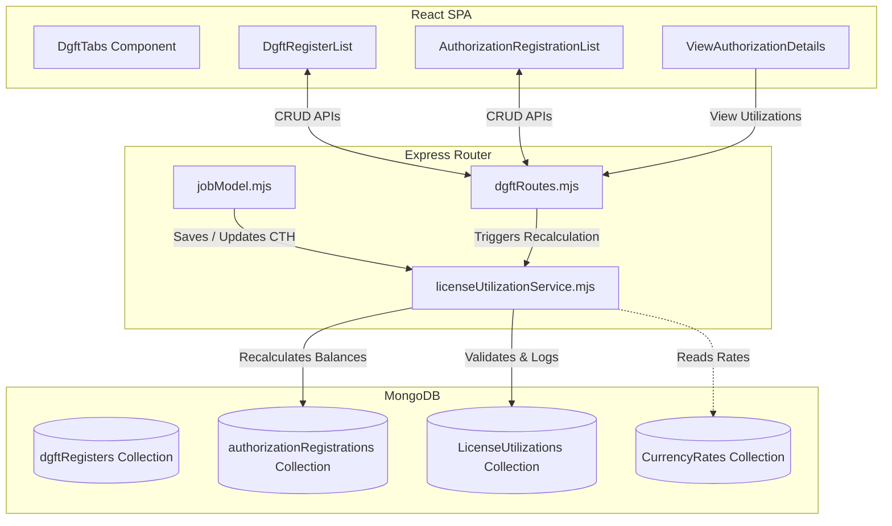

# DGFT Register & License Utilization Module

This document acts as a comprehensive knowledge transfer (KT) guide for developers working on the **DGFT (Directorate General of Foreign Trade) Register and License Utilization Module** in AlVision Exim.

---

## 1. Module Overview

The DGFT module manages and tracks two primary business workflows:
1.  **DGFT Register**: A record of all licensing applications, scheme registrations, submission dates, payments, and closed statuses. It acts as an operational log for the company's interactions with the DGFT.
2.  **License/Authorization Registration & Utilization**: Tracks actual licenses granted (Advance Authorization - AA, EPCG, etc.), the items allowed for import/export under those licenses, and automatically calculates and decrements balances when the licenses are utilized in operational jobs (DSRs).

---

## 2. System Architecture & Complete Workflow

The module utilizes a three-tier system of React components on the frontend, Express router handlers on the backend, and Mongoose schemas to track balances.



### Operational Workflows

#### A. Creating a License & Mapping Items
1.  Admin/HOD manually creates a license record in the **License Register** tab (`AuthorizationRegistrationList.js`).
2.  Import and Export items are added to `import_details_array` and `export_details_array` respectively, including `sr_no`, `hs_code`, `qty`, `unit`, `value_usd`, and `value_rs`.
3.  Each item's numeric limit is stored inside `licensed_qty`, `licensed_cif_usd`, and `licensed_cif_inr`.

#### B. Automatic DSR Job Utilization
When a documentation or operations user updates a DSR job (an import consignment):
1.  If the user maps a product line to a specific `license_no` and `license_sr` (item serial number):
    *   The system invokes `validateLicenseUtilization` inside `licenseUtilizationService.mjs` before saving.
    *   It checks validity, remaining quantity, remaining CIF USD/INR value, and checks for duplicates.
2.  If validation succeeds, the job is saved and `recalculateLicenseUtilizationForJob` is executed.
3.  Any previous utilization records for this job are deleted, new records are inserted in the `LicenseUtilizationModel` collection, and the affected licenses have their balances compiled and recalculated.

---

## 3. Database Models & Relationships

The DGFT module utilizes three main collections:

### 3.1 DgftRegister
*   **Schema Path**: [dgftRegisterModel.mjs](file:///C:/Users/india/Desktop/Projects/eximdev/server/model/dgftRegisterModel.mjs)
*   **Purpose**: Logs general applications and payment details submitted to DGFT.
*   **Key Fields**:
    *   `job_no` (String): Unique tracking identifier for the DGFT application.
    *   `scheme` (String): Type of scheme (e.g., AA, EPCG, IEC).
    *   `licence_no` (String): Final license number generated by DGFT.
    *   `eft_amount` / `transaction_amount` (String): Payment details.

### 3.2 AuthorizationRegistration
*   **Schema Path**: [authorizationRegistrationModel.mjs](file:///C:/Users/india/Desktop/Projects/eximdev/server/model/authorizationRegistrationModel.mjs)
*   **Purpose**: Tracks details and balances of actual issued licenses.
*   **Key Fields**:
    *   `registration_no` / `licence_no` (String): Unique license number.
    *   `import_validity` / `export_validity` (String: `DD/MM/YYYY` format): Expiry dates.
    *   `import_details_array` (Array of Objects): The items allowed.
        *   `sr_no` (Number): Serial number of item.
        *   `licensed_qty` / `licensed_cif_usd` / `licensed_cif_inr` (Numbers): Nominal limits.
        *   `total_utilized_qty` / `total_utilized_usd` / `total_utilized_inr` (Numbers): Summed from transactions.
        *   `balance_qty` / `balance_cif_usd` / `balance_cif_inr` (Numbers): Calculated remainders.
        *   `utilization_percent` (Number): Percentage utilized.
    *   `utilization_records` (Array): Legacy log table of utilizations. Modern architecture writes to `LicenseUtilization` instead.

### 3.3 LicenseUtilization
*   **Schema Path**: [licenseUtilizationModel.mjs](file:///C:/Users/india/Desktop/Projects/eximdev/server/model/licenseUtilizationModel.mjs)
*   **Purpose**: Transaction ledger logging each discrete utilization event of a license.
*   **Key Fields**:
    *   `authorization_no` (String): The referenced license.
    *   `license_sr` (Number): Serial number of the item.
    *   `job_id` (ObjectId): References the DSR job causing this utilization.
    *   `qty` / `cif_usd` / `cif_inr` (Number): Amounts utilized.
    *   `be_no` / `be_date` (String): Reference Bill of Entry details.

---

## 4. API Integration Flow

Endpoints are implemented in [dgftRoutes.mjs](file:///C:/Users/india/Desktop/Projects/eximdev/server/routes/dgft/dgftRoutes.mjs).

### 4.1 DGFT Register APIs
*   **GET** `/api/get-dgft-registers`: Fetches all registers.
*   **POST** `/api/add-dgft-register`: Creates a new record.
*   **PUT** `/api/update-dgft-register/:id`: Updates general details.
*   **DELETE** `/api/delete-dgft-register/:id`: Deletes record.
*   **POST** `/api/upload-dgft-register-excel` (Multer): Processes bulk Excel imports for DGFT applications.

### 4.2 License Register & Sync APIs
*   **GET** `/api/get-authorization-registrations`: Fetches all licenses.
*   **POST** `/api/add-authorization-registration`: Creates a license.
*   **PUT** `/api/update-authorization-registration/:id`: Updates license details, triggers a recalculation, and syncs compliance variables (`bg_number`, `bg_expiry_date`, `bond_number`, `bond_expiry_date`, etc.) to linked import operations in `JobModel` matching the license's BE numbers.
*   **POST** `/api/upload-dgft-register-excel-format`: Bulk imports licenses from Excel.

---

## 5. Important Calculations & Validations

The logic is contained within the [licenseUtilizationService.mjs](file:///C:/Users/india/Desktop/Projects/eximdev/server/services/licenseUtilizationService.mjs) module.

### 5.1 Currency Conversion
If the currency of the quantity on a job is not USD, the system converts values. The import rate is resolved dynamically:
1.  Checks `CurrencyRate` collections for active rates.
2.  If none is found, falls back to a hardcoded standard value of `84.0`.
3.  Conversion formulas:
    $$\text{cif\_usd} = \frac{\text{amount\_inr}}{\text{exchange\_rate}}$$
    $$\text{cif\_inr} = \text{amount\_usd} \times \text{exchange\_rate}$$

### 5.2 Validity & Period Checks
Before allowing utilization, the validator parses the `import_validity` field (formatted as `DD/MM/YYYY`):
```javascript
const [dd, mm, yyyy] = import_validity.split("/");
const expiryDate = new Date(`${yyyy}-${mm}-${dd}T23:59:59`);
```
If `today > expiryDate`, the system rejects the save, throwing a detailed validation error:
`Row X: Authorization "Y" has expired on DD/MM/YYYY.`

### 5.3 Balance Recalculation
Balances are compiled and set programmatically using:
$$\text{balance\_qty} = \max(0, \text{licensed\_qty} - \sum \text{utilized\_qty})$$
$$\text{balance\_cif\_usd} = \max(0, \text{licensed\_cif\_usd} - \sum \text{utilized\_usd})$$
$$\text{balance\_cif\_inr} = \max(0, \text{licensed\_cif\_inr} - \sum \text{utilized\_inr})$$
$$\text{utilization\_percent} = \frac{\sum \text{utilized\_qty}}{\text{licensed\_qty}} \times 100$$

Status is updated dynamically:
*   `Expired` if today > expiry date.
*   `Fully Utilized` if total utilized quantity $\ge$ licensed quantity.
*   `Partially Utilized` if total utilized quantity $> 0$.
*   `Available` otherwise.

---

## 6. Business Rules & Edge Cases

*   **Job Validation Duplicates**: The validator checks if a Bill of Entry (`be_no`) or job code (`job_no`) is already logged in `LicenseUtilizationModel` under a different `job_id`. If so, it throws: `This BE has already been utilized against the selected Authorization Item.`
*   **HS Code Matching Warning**: Currently, the HS code match requirement is commented out to allow manual overrides where minor HS variations occur. However, the system logs the DSR CTH value directly in the logs for audit.
*   **Compliance Sync**: Saving background values (like Bank Guarantee number or Bond expiry dates) on a license automatically updates all matching jobs with that Bill of Entry.
*   **Audit Logging**: The Mongoose `auditPlugin` records mutations on `DgftRegister`, `AuthorizationRegistration`, and `LicenseUtilization`. The `licenseUtilizationService.mjs` also manually constructs a detailed audit log entry when balances change.

---

## 7. Folder Structure

```
├── client/
│   └── src/
│       └── components/
│           └── dgft/
│               ├── DgftTabs.js                     # Tab manager component
│               ├── DgftRegisterList.js             # Table for DGFT Register
│               ├── AuthorizationRegistrationList.js # Table for License Register
│               ├── ViewAuthorizationDetails.js     # Details & Utilization tables
│               ├── ViewDgftRegisterDetails.js     # Single register view
│               └── dgft.scss                       # SCSS Styling
│
└── server/
    ├── app.mjs                                     # Express entry point
    ├── setupDgftWebSocket.mjs                       # WS broadcaster
    ├── routes/
    │   └── dgft/
    │       └── dgftRoutes.mjs                      # Express routes
    ├── model/
    │   ├── dgftRegisterModel.mjs                   # DgftRegister Schema
    │   ├── authorizationRegistrationModel.mjs      # AuthorizationRegistration Schema
    │   └── licenseUtilizationModel.mjs             # LicenseUtilization Schema
    └── services/
        └── licenseUtilizationService.mjs           # Balance compilation calculations
```

---

## 8. Configuration & Environment Variables

*   **API String**: The frontend uses `process.env.REACT_APP_API_STRING` to invoke the endpoints.
*   **Auditing**: Requires `AuditTrailModel` and context execution middlewares configured in `app.mjs`.

---

## 9. Troubleshooting Tips

### ⚠️ WebSockets Dynamic Import Issue
In `licenseUtilizationService.mjs`, you will see:
```javascript
const { broadcastLicenseUpdate } = await import("./setupDgftWebSocket.mjs");
```
Because the service is inside `server/services/`, this relative import resolves to `server/services/setupDgftWebSocket.mjs`, which does not exist (the file lives in `server/setupDgftWebSocket.mjs`).
*   **Impact**: Balance updates will not be live-broadcasted to connected browsers via WebSockets; clients will need to refresh the page to view updated balances.
*   **Resolution**: Update the import path to `../setupDgftWebSocket.mjs`.

### ⚠️ Expiry date parsing failures
If `import_validity` values are inputted with single-digit months or years (e.g. `20/5/25` or `20-05-2025`), date parsing will crash or parse incorrectly. Ensure inputs strictly use the `DD/MM/YYYY` format or let the Excel normalizer parser correct them.

---

## 10. Future Improvements

1.  **EPCG Obligation Milestones**: Implement native EPCG tracking where export obligations can be logged against specific shipping bills (SBs) to automatically decrement the obligation amount.
2.  **Fix WebSocket Path**: Adjust the relative path in the service engine to enable live updates on the client UI.
3.  **Strict HS Code Check**: Introduce a config toggle to strictly enforce HS Code matches between licenses and imported product lines.
