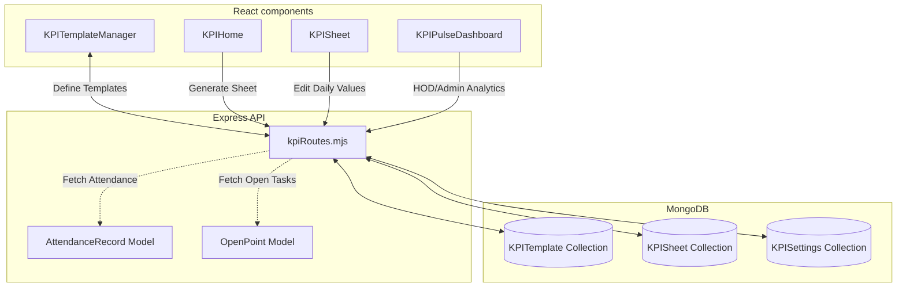

# Key Performance Indicators (KPI) Module

This document acts as a comprehensive knowledge transfer (KT) guide for developers working on the **Key Performance Indicators (KPI) Module** in AlVision Exim.

---

## 1. Module Overview

The KPI module is a multi-lingual monthly employee performance assessment workbook. It allows employees to self-report daily metrics against defined parameters, which then traverse a multi-stage approval workflow:
*   **Prepared By** (Employee) $\rightarrow$ **Checked By** (HOD/Supervisor) $\rightarrow$ **Verified By** (Shalini/Audit) $\rightarrow$ **Approved By** (Top Management / CEO).

It includes automatic score calculations, holiday exclusions, business loss reporting, and categorizes employees into a 2D performance matrix.

---

## 2. System Architecture & Complete Workflow

The module consists of React state management for grid inputs, an Express api router, and monthly MongoDB documents.



### Operational Lifecycles

#### A. Template Definition
1.  HOD or Admin creates a reusable template (`KPITemplate`) for a department or user.
2.  Each parameter (row) is defined with a `type` (numeric, calculated, checkbox) and a `weight` (from 1 to 5).
3.  Row titles support translation (English, Hindi, and Gujarati) via Google Translate API.

#### B. Monthly Workbook Cycle
1.  **Generation**: At the start of a month, the employee triggers `/api/kpi/sheet/generate`. This copies the active template rows into a new monthly `KPISheet`.
2.  **Daily Recording**: The employee logs daily numbers into the cells. Saving drafts executes `/api/kpi/sheet/entry`.
3.  **Holidays & Sundays**: Excluded days (Leaves, Festivals, Sundays) are registered. Excluded days auto-skip calculation values to avoid penalizing performance.
4.  **Submission**: Employee fills in Business Loss and Action Plan, then submits the sheet.
5.  **Signature Chain**: Signatories log approvals. The document moves from `DRAFT` $\rightarrow$ `SUBMITTED` $\rightarrow$ `CHECKED` $\rightarrow$ `VERIFIED` $\rightarrow$ `APPROVED`. If rejected at any stage, it returns to `DRAFT` for correction.

---

## 3. Database Models & Relationships

The KPI module uses three primary collections:

### 3.1 KPITemplate
*   **Schema Path**: [kpiTemplateModel.mjs](file:///C:/Users/india/Desktop/Projects/eximdev/server/model/kpi/kpiTemplateModel.mjs)
*   **Purpose**: Reusable blueprints defining the KPI rows for a specific department or user.
*   **Key Fields**:
    *   `owner` (ObjectId): User who owns/created the template.
    *   `department` (String): Target department.
    *   `rows` (Array): Parameter specs:
        *   `id` (String): Static row code.
        *   `label` / `label_gu` / `label_hi` (String): Translations.
        *   `type` (String: `numeric` / `calculated` / `checkbox`).
        *   `weight` (Number: 1-5, default 3).
        *   `is_high_volume` (Boolean).
    *   `version` (Number): Increments on edit; older versions remain immutable.

### 3.2 KPISheet
*   **Schema Path**: [kpiSheetModel.mjs](file:///C:/Users/india/Desktop/Projects/eximdev/server/model/kpi/kpiSheetModel.mjs)
*   **Purpose**: The actual monthly worksheet storing daily values and signature state.
*   **Key Fields**:
    *   `user` (ObjectId): References the Employee.
    *   `department` (String) & `year` (Number) & `month` (Number).
    *   `rows` (Array): Stores actual values.
        *   `daily_values` (Map: key string day "1"-"31" $\rightarrow$ Number).
        *   `total` (Number): Sum of the daily values.
        *   `weight` (Number): Dynamic copy of template weight.
    *   `holidays` / `festivals` / `half_days` / `working_sundays` (Arrays of numbers): Excluded days.
    *   `status` (String: `DRAFT`, `SUBMITTED`, `CHECKED`, `VERIFIED`, `APPROVED`, `REJECTED`).
    *   `summary` (Object):
        *   `business_loss` (Number) & `loss_description` (String).
        *   `total_value_score` & `average_complexity` & `total_quantity` (Numbers).
        *   `performance_quadrant` (String: `Star`, `Specialist`, `Engine`, `Drainer`).
    *   `signatures` / `assigned_signatories` (Objects): Capture usernames and timestamps for the signature chain.

### 3.3 KPISettings
*   **Schema Path**: [kpiSettingsModel.mjs](file:///C:/Users/india/Desktop/Projects/eximdev/server/model/kpi/kpiSettingsModel.mjs)
*   **Purpose**: Dynamic configuration variables (such as threshold limits).

---

## 4. Important Calculations & Validations

The primary metric engine runs in [kpiRoutes.mjs](file:///C:/Users/india/Desktop/Projects/eximdev/server/routes/kpi/kpiRoutes.mjs).

### 4.1 Value Score & Average Complexity
For each row, the sum is computed over all days, *excluding* Sundays (unless marked in `working_sundays`), `holidays`, and `festivals`:
$$\text{Row Total} = \sum_{d \in \text{Working Days}} \text{daily\_value}[d]$$
$$\text{Total Value Score} = \sum (\text{Row Total} \times \text{Row Weight})$$
$$\text{Total Quantity} = \sum \text{Row Total}$$
$$\text{Average Complexity} = \frac{\text{Total Value Score}}{\text{Total Quantity}} \quad (\text{if Quantity} > 0)$$

### 4.2 Performance Quadrant
The employee's performance is mapped onto a 2D grid based on **Quantity** (Volume) and **Average Complexity** (Weight):
*   **Weight Threshold**: `3.0`
*   **Volume Threshold**: `100`

$$\text{Performance Quadrant} = 
\begin{cases} 
\text{Star} & \text{Complexity} \ge 3.0 \text{ and Quantity} \ge 100 \\
\text{Specialist} & \text{Complexity} \ge 3.0 \text{ and Quantity} < 100 \\
\text{Engine} & \text{Complexity} < 3.0 \text{ and Quantity} \ge 100 \\
\text{Drainer} & \text{Complexity} < 3.0 \text{ and Quantity} < 100 
\end{cases}$$

### 4.3 Auto-Calculation of Attendance & Tasks (Pulse Sync)
When compiling official scores (in `/api/kpi/admin/stats`), the server pulls direct metrics from:
1.  **Attendance**: Resolves `present`, `half_day`, `weekly_off`, `holiday`, and `late` status from `AttendanceRecord` models to calculate actual working vs present days.
2.  **Open Points**: Queries `OpenPoint` models to count the active, unresolved issues assigned to the user:
    $$\text{Open Task Score} = \max(0, 10 - \text{Open Points Count})$$

---

## 5. API Integration Flow

Endpoints are declared in [kpiRoutes.mjs](file:///C:/Users/india/Desktop/Projects/eximdev/server/routes/kpi/kpiRoutes.mjs).

*   **POST** `/api/kpi/template`: Create/update a template.
*   **GET** `/api/kpi/templates`: Fetches templates available to the user.
*   **GET** `/api/kpi/sheet`: Retrieve active sheet matching user/year/month query.
*   **POST** `/api/kpi/sheet/generate`: Initializes monthly sheet from active template.
*   **PUT** `/api/kpi/sheet/entry`: Saves cell draft values.
*   **POST** `/api/kpi/sheet/submit`: Submits draft sheet; locks user modifications.
*   **POST** `/api/kpi/sheet/sign-action`: Executes signature actions (`SUBMIT`, `CHECK`, `VERIFY`, `APPROVE`, `REJECT`).
*   **GET** `/api/kpi/admin/all-sheets`: Lists all sheets in system (Admin view).
*   **GET** `/api/kpi/admin/submission-status`: Shows checklist of who has or has not generated/submitted their monthly sheets.

---

## 6. Business Rules & Edge Cases

*   **Immutable Template Versions**: To protect historical monthly sheets, editing a template does not overwrite it. Instead, the current template is marked `is_active: false` and a new version document is saved with `version = version + 1`. Existing sheets link to their original `template_version` object.
*   **Lock Enforcement**: Once a weekly block is locked or the sheet is `SUBMITTED`, cell updates on those days throw an error.
*   **Rejection Reset**: When a signatory rejects a sheet, the status goes back to `DRAFT` and all signatures are cleared, allowing the employee to correct cell values and submit again.
*   **Custom Rows**: Employees can add manual one-off rows (`is_custom: true`) to record unique assignments not captured by the department template.

---

## 7. Folder Structure

```
├── client/
│   └── src/
│       └── components/
│           └── kpi/
│               ├── KPIHome.js               # User entry board
│               ├── KPISheet.js              # 31-day data entry grid
│               ├── KPITemplateManager.js    # Define template parameters
│               ├── KPIReviewerDashboard.js  # Signature list panel
│               ├── KPIPulseDashboard.js     # Operational HOD dashboard
│               ├── KPIAdminDashboard.js     # Top administration panel
│               ├── KPIConstants.js          # Blocker & Loss lists
│               └── kpi.scss                 # Component styles
│
└── server/
    └── routes/
        └── kpi/
            └── kpiRoutes.mjs                # KPI REST API routes
```

---

## 8. Configuration & Environment Variables

*   **Google Translation API**: Uses `google-translate-api-x` internally in `kpiRoutes.mjs` to auto-translate labels. Ensure the server has outgoing internet access.
*   **Signatories Assignments**: Mapped during sheet initialization or via the settings schema.

---

## 9. Troubleshooting Tips

### ⚠️ Google Translation Failure
If the external translation request fails, template creation will return a `500 Server Error`.
*   **Workaround**: If offline, verify if the translate package handles failover by falling back to the English string.

### ⚠️ Missing Attendance Scores
If attendance scores on the dashboard show `0` despite punches:
*   Ensure that the `AttendanceRecord` collection contains compiled documents for that month using the matching format `YYYY-MM`.

---

## 10. Future Improvements

1.  **Direct Tally Ingestion**: Automatically populate billing or operations quantities by directly querying invoice entries from Tally databases.
2.  **Audit History Visualizer**: Add a visual history diff viewer inside the client grid to let reviewers trace cell edits.
