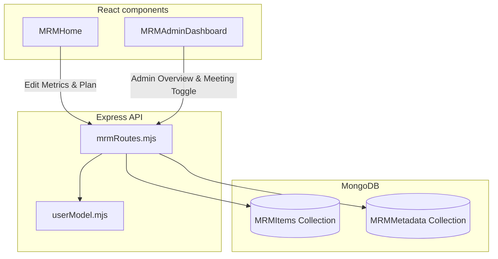

# Management Review Meeting (MRM) Module

This document acts as a comprehensive knowledge transfer (KT) guide for developers working on the **Management Review Meeting (MRM) Module** in AlVision Exim.

---

## 1. Module Overview

The Management Review Meeting (MRM) module coordinates department-level performance evaluation. Every month, HODs (Heads of Departments) create and track operational criteria (objectives, target thresholds, actual performance, action plans, and execution statuses). Admins can view these department records on a single dashboard, review notes, set meeting schedules, and finalize review statuses.

---

## 2. System Architecture & Complete Workflow

The module utilizes an interactive grid view, sequence shift APIs, and user-month-year compound indexes in MongoDB.



### Operational Workflows

#### A. Creating and Tracking Objectives (HOD Workflow)
1.  **Goal Setup**: At the start of a month, the HOD logs process descriptions, targets, and monitoring frequencies.
2.  **Importing Previous Month**: HODs can save time by importing criteria from a previous month (using either `'as-is'` or `'blank'` copy mode).
3.  **Actual Recording**: Throughout the month, the HOD enters actual metrics and details of deviations.
4.  **Status Coloring**: Tasks are marked with colors based on achievement:
    *   `Gray`: Not evaluated / Draft.
    *   `Red`: Target missed / No action planned.
    *   `Yellow`: Progressing / Partially met.
    *   `Green`: Target achieved.
5.  **Sorting & Inserting**: Row ordering can be adjusted dynamically. HODs can insert rows at any specific index or drag-and-drop rows to reorder them.

#### B. Review and Locking (Admin Workflow)
1.  **Dashboard Compilation**: The Admin views a compiled matrix listing item counts, status counts, and scheduled dates for all departments.
2.  **Scheduling**: The Admin sets the `meetingDate` and `reviewDate` for each department.
3.  **Toggling Meeting Done**: Once a review is complete, the Admin toggles the `meetingDone` checkbox to archive the month's records.

---

## 3. Database Models & Relationships

The MRM module is supported by two main collections:

### 3.1 MRMItem
*   **Schema Path**: [mrmItemModel.mjs](file:///C:/Users/india/Desktop/Projects/eximdev/server/model/mrm/mrmItemModel.mjs)
*   **Purpose**: Represents a single criteria row inside a department's monthly review sheet.
*   **Key Fields**:
    *   `month` (String) & `year` (Number): e.g. `"05"` & `2026`.
    *   `processDescription` & `objective` & `target` (Strings): Goal parameters.
    *   `monitoringFrequency` & `responsibility` (Strings).
    *   `actual` & `plan` (Strings): Performance details.
    *   `actionPlan` & `responsibilityAction` (Strings): Recovery items.
    *   `targetDate` (Date): Plan target date.
    *   `status` (String: `Gray` (default), `Red`, `Yellow`, `Green`).
    *   `seq` (Number): Sort index for rendering.
    *   `isTitleRow` (Boolean): Allows group headers in the grid.
    *   `bgColor` (String): Custom styling.
    *   `createdBy` (ObjectId): References the author HOD (`UserModel`).

### 3.2 MRMMetadata
*   **Schema Path**: [mrmMetadataModel.mjs](file:///C:/Users/india/Desktop/Projects/eximdev/server/model/mrm/mrmMetadataModel.mjs)
*   **Purpose**: Manages review dates and archiving checkboxes per department.
*   **Key Fields**:
    *   `month` (String) & `year` (Number) & `userId` (ObjectId).
    *   `meetingDate` (Date): The scheduled review date.
    *   `reviewDate` (Date): The target follow-up date.
    *   `meetingDone` (Boolean): Archive flag.

---

## 4. Important Calculations & Validations

The logic is contained within [mrmRoutes.mjs](file:///C:/Users/india/Desktop/Projects/eximdev/server/routes/mrm/mrmRoutes.mjs).

### 4.1 Middle Insertion Shifts
When an HOD adds an item at a specific position instead of appending it, the server shifts all subsequent indices:
```javascript
if (insertAfterSeq !== undefined) {
    await MRMItem.updateMany(
        { month, year, createdBy, seq: { $gt: insertAfterSeq } },
        { $inc: { seq: 1 } }
    );
    const item = new MRMItem({ ...req.body, seq: insertAfterSeq + 1 });
    await item.save();
}
```
This keeps sorting indexes sequential and correct.

### 4.2 Bulk Reordering
Drag-and-drop reordering sends an array of `{ _id, seq }` to `/api/mrm-bulk/reorder`. The server updates these positions in a single transaction:
```javascript
const bulkOps = items.map(item => ({
    updateOne: {
        filter: { _id: item._id },
        update: { $set: { seq: item.seq } }
    }
}));
await MRMItem.bulkWrite(bulkOps);
```

### 4.3 Copying Modes for Imports
When importing goals from a previous month (`/api/mrm/import`):
1.  **As-Is Mode (`as-is`)**: Duplicates the items exactly as they were, including `actual`, `plan`, and `status`.
2.  **Blank Mode (`blank`)**: Copies the descriptors (`objective`, `target`, `responsibility`, etc.) but resets status to `Gray`, actual/plan fields to empty strings, and dates to `null`.

---

## 5. API Integration Flow

Endpoints are declared in [mrmRoutes.mjs](file:///C:/Users/india/Desktop/Projects/eximdev/server/routes/mrm/mrmRoutes.mjs).

*   **GET** `/api/mrm/users`: Lists active users to allocate sheets.
*   **GET** `/api/mrm/dashboard` (Admin only): Gathers item status counts and meeting states to display on the Admin dashboard.
*   **GET** `/api/mrm/metadata`: Fetches review dates and lock statuses.
*   **POST** `/api/mrm/metadata`: Creates or updates scheduling dates.
*   **POST** `/api/mrm/metadata/toggle-meeting` (Admin only): Sets the archive state.
*   **GET** `/api/mrm`: Fetches review rows.
*   **POST** `/api/mrm`: Adds a row (handles sequence shifts).
*   **PUT** `/api/mrm-bulk/reorder`: Adjusts row order using Mongoose bulk write.
*   **PUT** `/api/mrm/:id`: Updates an individual row.
*   **DELETE** `/api/mrm/:id`: Deletes a row.
*   **POST** `/api/mrm/import`: Imports templates using either `'as-is'` or `'blank'` mode.

---

## 6. Business Rules & Edge Cases

*   **Role Enforcement**: Only HODs or Admins with the "MRM" module enabled can create sheets. HODs can only view and edit their own sheets, while Admins can view and toggle statuses for all sheets in the system.
*   **Archiving**: When `meetingDone` is set to `true` in `MRMMetadata`, the client UI locks inputs for that month to prevent modifications after a review is complete.
*   **Title Rows**: Rows with `isTitleRow: true` are used to categorize objectives (e.g. "Operational Excellence" or "Customer Care"). These rows ignore actual/target metrics and render with custom background colors.

---

## 7. Folder Structure

```
├── client/
│   └── src/
│       └── components/
│           └── mrm/
│               ├── MRMHome.js               # HOD editing grid & import buttons
│               └── MRMAdminDashboard.js     # Admin list & calendar toggler
│
└── server/
    └── routes/
        └── mrm/
            └── mrmRoutes.mjs                # REST API routes
```

---

## 8. Troubleshooting Tips

### ⚠️ Old Unique Index Collision
Older versions of `mrmMetadataModel.mjs` had a unique index on `{ month: 1, year: 1 }`. This restricted the collection to one meeting per month, preventing multiple HODs from having their own reviews.
*   **Fix**: The schema file automatically runs a drop-index script upon startup:
    `MRMMetadata.collection.dropIndex('month_1_year_1')`
    If a database error occurs on startup, manually drop this index using a MongoDB shell.

### ⚠️ Input Grid Not Saving
If changes are not saved to the database:
*   Ensure that the target month is not locked (i.e. `meetingDone` is not set to `true` in the metadata).
