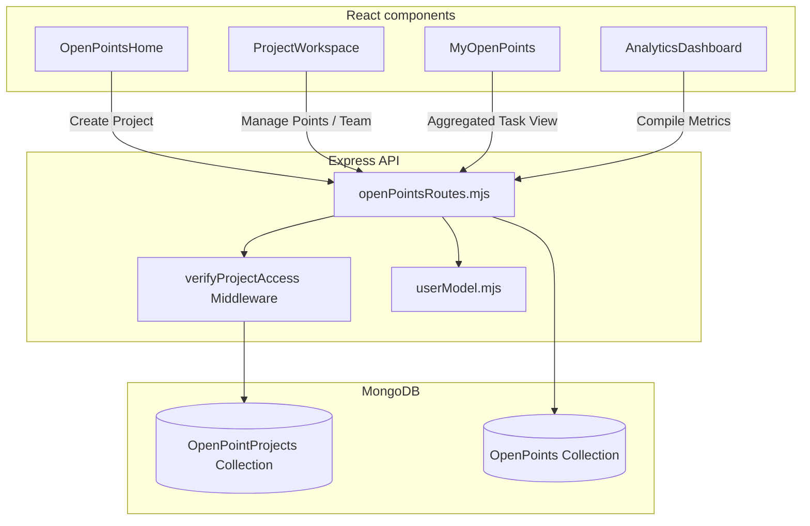

# Open Points Tracking Module

This document acts as a comprehensive knowledge transfer (KT) guide for developers working on the **Open Points Tracking Module** in AlVision Exim.

---

## 1. Module Overview

The Open Points Tracking module is a project-based issue tracker designed to identify gaps, action items, and task priorities. It allows users to create discrete projects, assign team members with specific roles (L1–L4), add points (tasks) with sequential tracking IDs, log history updates, upload evidence files, and view statistical health charts.

---

## 2. System Architecture & Complete Workflow

The module utilizes React board lists, Express router verification hooks, and MongoDB indexes.



### Operational Workflows

#### A. Project Lifecycle
1.  **Creation**: A manager creates a project (`OpenPointProject`) in `OpenPointsHome.js`.
2.  **Initials Generation**: The server auto-generates a unique abbreviation (initials) based on the project name.
3.  **Member Registration**: Users are added to the project team with specific roles (`L1`, `L2`, `L3`, `L4`). Adding a member automatically updates the user's document to grant permission to access the "Open Points" module in AlVision Exim.

#### B. Open Point (Task) Lifecycle
1.  **Creation**: A team member adds a point to a project. The server assigns it a sequence number and tags it (e.g. `PROJ-001`).
2.  **Status Transition**: Tasks begin at `Red` (Not Started) or `Orange` (Critical Delay). As work proceeds, they move to `Yellow` (Ongoing), and finally to `Green` (Completed) upon approval.
3.  **Completion**: Resolving a task to `Green` automatically populates the `completion_date` to the current timestamp.
4.  **Evidence Upload**: Supporting documents (PDFs, images) are uploaded as evidence to AWS S3.
5.  **History & Auditing**: Every status change or remarks modification writes a transaction log to the `history` sub-array.

---

## 3. Database Models & Relationships

The module uses two collections:

### 3.1 OpenPointProject
*   **Schema Path**: [openPointProjectModel.mjs](file:///C:/Users/india/Desktop/Projects/eximdev/server/model/openPoints/openPointProjectModel.mjs)
*   **Purpose**: Represents a project dashboard containing a team of users.
*   **Key Fields**:
    *   `name` (String): Unique project title.
    *   `initials` (String): Unique capital initials (e.g. `MKT`, `DGFT`).
    *   `owner` (ObjectId): References the project manager (`UserModel`).
    *   `team_members` (Array):
        *   `user` (ObjectId): References the member user.
        *   `role` (String: `L1` (Guest), `L2` (Operator), `L3` (Supervisor), `L4` (Manager)).
        *   `department` (String).

### 3.2 OpenPoint
*   **Schema Path**: [openPointModel.mjs](file:///C:/Users/india/Desktop/Projects/eximdev/server/model/openPoints/openPointModel.mjs)
*   **Purpose**: Represents a specific action task inside a project.
*   **Key Fields**:
    *   `project_id` (ObjectId): References the parent `OpenPointProject`.
    *   `unique_id` (String): Generated task key, indexed for quick lookups (e.g., `HR-12`).
    *   `seq_id` (Number): Incremental integer ID within the project.
    *   `title` & `description` (Strings).
    *   `status` (String: `Red`, `Yellow`, `Orange`, `Green`).
    *   `responsible_person` (ObjectId): References the assigned worker.
    *   `reviewer` (ObjectId): References the reviewer who verifies completion.
    *   `evidence` (Array): Tracks uploaded files (`file_url`, `uploaded_by`, `uploaded_at`).
    *   `history` (Array): Logs changes (`action`, `changed_by`, `timestamp`, `remarks`).

---

## 4. Important Calculations & Validations

The logic is contained within [openPointsRoutes.mjs](file:///C:/Users/india/Desktop/Projects/eximdev/server/routes/open-points/openPointsRoutes.mjs).

### 4.1 Initials Allocation
When creating a project, initials are auto-generated from the name. To prevent duplicate initials across projects, the server executes a search loop:
```javascript
let baseInitials = generateInitials(projectName);
let initials = baseInitials;
let counter = 1;
while (true) {
    const existing = await OpenPointProject.findOne({ initials });
    if (!existing) return initials;
    counter++;
    initials = `${baseInitials}${counter}`; // e.g. ACC, ACC2, ACC3...
}
```

### 4.2 Sequence Number Resolver
For each new open point, the next code number is calculated atomically relative to the current project:
```javascript
const lastPoint = await OpenPoint.findOne({ project_id: projectId }).sort({ seq_id: -1 });
const nextSeqId = lastPoint && lastPoint.seq_id ? lastPoint.seq_id + 1 : 1;
```
This guarantees contiguous sequence IDs (e.g., `1`, `2`, `3`) per project even if tasks are deleted.

### 4.3 Statistical Health Compiler
Project lists return aggregate counters:
*   `stats`: Total count of points categorized by status (`red`, `yellow`, `orange`, `green`) across the project.
*   `myStats`: Count of tasks assigned *only* to the currently logged-in user, which powers the personal dashboard counts.

---

## 5. API Integration Flow

Endpoints are declared in [openPointsRoutes.mjs](file:///C:/Users/india/Desktop/Projects/eximdev/server/routes/open-points/openPointsRoutes.mjs).

*   **POST** `/api/open-points/projects`: Creates a project; generates initials.
*   **PUT** `/api/open-points/projects/:projectId`: Updates project metadata (Owner only).
*   **DELETE** `/api/open-points/projects/:projectId`: Cascades deletion of the project and all linked `OpenPoint` tasks.
*   **POST** `/api/open-points/project/:projectId/add-member`: Registers team members and appends `'Open Points'` to their user document module clearance array.
*   **GET** `/api/open-points/project/:projectId/points`: Loads points for a specific project workspace.
*   **POST** `/api/open-points/points`: Creates a task; generates unique sequence code.
*   **PUT** `/api/open-points/points/:pointId`: Updates task columns, registers history, and appends to evidence links.

---

## 6. Business Rules & Edge Cases

*   **Access Isolation**: The `verifyProjectAccess` middleware ensures that only the project owner or registered team members can view or modify project contents. Non-members receive an `HTTP 403 Forbidden` response.
*   **Cascade Deletions**: Deleting a project cascades. It deletes all associated tasks in the database and cleans up references.
*   **Overdue Checking**: When loading tasks via the API, the system automatically checks if the `target_date` is in the past for incomplete items. If overdue, it updates their status to `Red` in the database.
*   **L1–L4 Permission Matrix**:
    *   `L1`: Read-only.
    *   `L2`: Create tasks, move status of assigned tasks.
    *   `L3`: Create/edit tasks, modify assignees.
    *   `L4` (Owner): Full administrator control (add/remove members, delete project).

---

## 7. Folder Structure

```
├── client/
│   └── src/
│       └── components/
│           └── open-points/
│               ├── OpenPointsHome.js         # Project dashboard
│               ├── ProjectWorkspace.js       # Kanban board / task drawer
│               ├── MyOpenPoints.js           # Personal aggregated tasks
│               └── AnalyticsDashboard.js     # Health statistics
│
└── server/
    └── routes/
        └── open-points/
            └── openPointsRoutes.mjs          # REST routes & project security
```

---

## 8. Troubleshooting Tips

### ⚠️ Cascade Upload Failures
If uploading files in the drawer returns S3 errors:
*   Verify that S3 bucket configuration variables are correctly defined in `server/.env`.
*   Verify if the backend port matches the reverse proxy tunnel configuration mapping.

### ⚠️ Duplicate Initials Conflicts
If project creation fails:
*   Ensure that the initials generation loop does not get stuck. Check the DB for indices matching `initials`.
