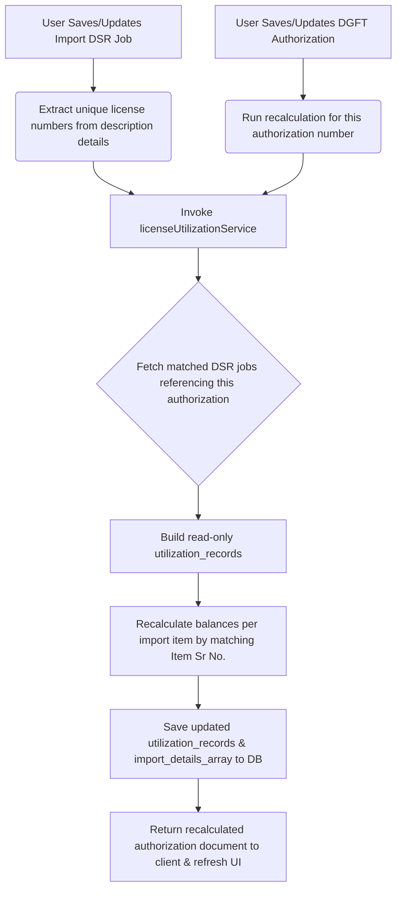

# DGFT License Utilization & Import DSR Integration Flow

This document details the database schema design, calculation formulas, backend integration triggers, and UI layout representing the integration between the **DGFT License Register** and the **Import DSR (Daily Status Report)** modules.

---

## 1. High-Level Architecture Flow

---

## 2. Database Schema Fields

### A. Authorization Registration Model (`authorizationRegistrationModel.mjs`)

Stores original licensed items and dynamic utilization history:

- **`import_details_array`**: Array of original licensed items:
  - `sr_no` (Number): Serial number of the item (e.g. `1`, `2`, `3`...). Matches `license_sr` in the DSR job.
  - `item_description` (String): Original description of the item.
  - `hs_code` (String): Harmonized System code.
  - `qty` (String): Licensed quantity (inputted by user).
  - `unit` (String): Measurement unit (e.g. `KGS`, `PCS`).
  - `value_usd` (String): CIF value in USD.
  - `value_rs` (String): CIF value in INR.
  - **`total_utilized_qty`** (Number): Sum of all quantities utilized across DSR jobs for this serial number.
  - **`total_utilized_usd`** (Number): Sum of all values utilized (converted to USD) across DSR jobs for this serial number.
  - **`auto_balance_qty`** (Number): Remaining balance quantity (`qty - total_utilized_qty`).
  - **`auto_balance_cif_usd`** (Number): Remaining balance CIF USD (`value_usd - total_utilized_usd`).
  - **`auto_balance_cif_inr`** (Number): Remaining balance CIF INR (`auto_balance_cif_usd * current_usd_rate`).

- **`utilization_records`**: Automatically populated read-only array of specific DSR job transactions:
  - `sr_no` (Number): Matches the license item serial number (`import_details_array[].sr_no`).
  - `job_no` (String): The Import DSR Job number (e.g., `AMD/IMP/SEA/00074/26-27`).
  - `be_no` (String): The Bill of Entry number.
  - `be_date` (String): The Bill of Entry date.
  - `qty` (Number): Utilized quantity.
  - `unit` (String): Utilized unit.
  - `cif_usd` (Number): Utilized CIF USD.
  - `cif_inr` (Number): Utilized CIF INR.
  - `port` (String): Port of import.

---

### B. Import DSR Job Model (`jobModel.mjs`)

Contains product items linking to the authorization license:

- **`description_details`**: Array of product details:
  - `license_no` (String): The Authorization/License Number.
  - `license_sr` (Number): The specific Item Serial Number (1, 2, 3...) utilized.
  - `quantity` (Number): Utilized quantity.
  - `unit` (String): Measurement unit.
  - `amount` (Number): Utilized value.
  - `amount_currency` (String): Currency of the item value (`USD` or `INR`).

---

## 3. Calculation & Recalculation Logic

When the `licenseUtilizationService` runs `recalculateLicenseUtilization(authorizationNo)`:

1. **Exchange Rate Fetch**: The system fetches the latest active exchange rate for `USD` from the `CurrencyRate` table (falls back to `84` INR/USD if not found).
2. **Job Lookup**: It finds all Import Operation jobs where `description_details.license_no === authorizationNo`.
3. **Record Generation**: For each matching row in the job's product details:
   - It extracts the utilized quantity (`quantity`) and amount (`amount`).
   - If the item's currency is `INR`, it calculates:
     $$\text{Utilized CIF USD} = \frac{\text{amount}}{\text{job.exrate}}$$
     $$\text{Utilized CIF INR} = \text{amount}$$
   - If the item's currency is `USD` (or any other currency), it calculates:
     $$\text{Utilized CIF USD} = \text{amount}$$
     $$\text{Utilized CIF INR} = \text{amount} \times \text{job.exrate}$$
   - Saves a record in `utilization_records` storing the quantity, unit, BE Details, job number, and values.
4. **Summing & Deducting (Balances)**:
   - For each item in `import_details_array`:
     - Matches the item's `sr_no` with the `sr_no` of the `utilization_records`.
     - Sums the total utilized quantity:
       $$\text{Total Utilized Qty} = \sum \text{record.qty}$$
     - Sums the total utilized USD value:
       $$\text{Total Utilized USD} = \sum \text{record.cif\_usd}$$
     - Deducts from the licensed limits entered by the user:
       $$\text{Auto Balance Qty} = \max(0, \text{qty} - \text{Total Utilized Qty})$$
       $$\text{Auto Balance CIF USD} = \max(0, \text{value\_usd} - \text{Total Utilized USD})$$
       $$\text{Auto Balance CIF INR} = \text{Auto Balance CIF USD} \times \text{latest\_usd\_rate}$$

---

## 4. UI Layout & View Details Integration

### A. Dynamic Inline Balance Labels

On the DGFT Authorization details screen (`ViewAuthorizationDetails.js`), dynamic balance and utilization information is displayed immediately beneath the input fields of each item in the **Import Details** grid:

- **Under Qty (Import)**:
  - Displays: `Util: {row.total_utilized_qty}  Bal: {row.auto_balance_qty}`
- **Under Value (CIF USD)**:
  - Displays: `Util: ${row.total_utilized_usd}  Bal: ${row.auto_balance_cif_usd}`
- **Under Value (CIF Rs)**:
  - Displays: `Bal: ₹{row.auto_balance_cif_inr}`

### B. Utilization Records (Linked DSR Jobs Table)

The legacy manual table is replaced with a read-only **Utilisation Details** table. This table fetches and displays the `utilization_records` from the backend in real-time, detailing:
1. **Lic Item Sr**: Item index matched on the license.
2. **Job No.**: Linked Import DSR job number.
3. **Item Description**: Product item description.
4. **BE No. / Date**: Bill of entry details.
5. **Qty & Unit**: Utilized quantity.
6. **CIF USD / CIF INR**: Value utilized.
7. **Port**: Port of import.
