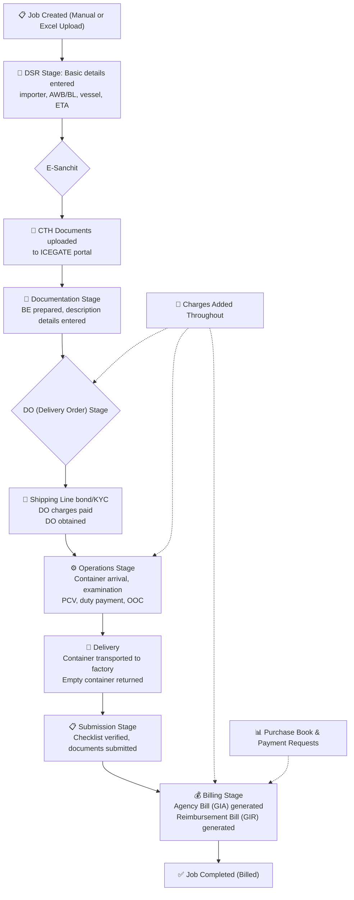

# AlVision EXIM Database — Comprehensive Reference Guide

> **Purpose**: This document provides a complete understanding of the AlVision EXIM (Export-Import) database for marketing, analytics, and data science purposes. It is designed so that any LLM or analyst can use it as a primary reference without needing to re-explore the database.

> **Database Technology**: MongoDB (via Mongoose ODM) — all "tables" are MongoDB **collections** and all "rows" are **documents**. Relationships are maintained through ObjectId references and denormalized string fields.

---

## Table of Contents

1. [Database Overview](#1-database-overview)
2. [Domain Architecture](#2-domain-architecture)
3. [Core Operations — The Job Collection](#3-core-operations--the-job-collection)
4. [CRM & Sales Pipeline](#4-crm--sales-pipeline)
5. [Customer KYC](#5-customer-kyc)
6. [Master Directory (Reference Data)](#6-master-directory-reference-data)
7. [Financial & Billing](#7-financial--billing)
8. [HR & Workforce Management](#8-hr--workforce-management)
9. [Performance Management (KPI, MRM, Open Points)](#9-performance-management-kpi-mrm-open-points)
10. [Governance & Compliance](#10-governance--compliance)
11. [Relationships Between Collections](#11-relationships-between-collections)
12. [Data Flow — How a Consignment Moves Through the System](#12-data-flow--how-a-consignment-moves-through-the-system)
13. [EXIM Business Terminology Glossary](#13-exim-business-terminology-glossary)
14. [Marketing & Analytics Use Cases](#14-marketing--analytics-use-cases)
15. [Data Quality Considerations & Assumptions](#15-data-quality-considerations--assumptions)

---

## 1. Database Overview

AlVision EXIM is a full-lifecycle **customs house agent (CHA) / customs broker management system** used by an Indian export-import services company. It digitizes the end-to-end workflow that was previously managed through Excel spreadsheets.

### What the database captures:

| Domain | What it records |
|--------|----------------|
| **Core Operations** | Every import/export consignment ("Job") from receipt to delivery and billing |
| **CRM** | Leads, accounts, contacts, opportunities, quotes, sales forecasting |
| **Customer KYC** | Importer/exporter registration, compliance documents, multi-level approvals |
| **Master Directory** | Reference data — countries, ports, airlines, shipping lines, CFS, transporters |
| **Finance** | Bills, charges, purchase books, payment requests, ledger balances |
| **DGFT** | License registrations, authorization utilization, export obligation tracking |
| **HR** | Employee onboarding, KYC, attendance, leave, payroll, exit interviews |
| **KPI / MRM** | Employee performance sheets, management review meetings |
| **Audit** | Immutable trail of every create/update/delete across key collections |

### Scale Indicators

- The **Job** collection is the largest and most complex document (~950-line schema, 200+ fields)
- Multi-branch, multi-tenant architecture with branch-level data isolation
- Financial year and calendar year–based partitioning on most operational data
- Real-time WebSocket feeds for job overview and analytics dashboards

---

## 2. Domain Architecture

```mermaid
graph TB
    subgraph "Core Operations"
        JOB["Job (Consignment)"]
        BILL["Bill"]
        CHG["Charges (embedded in Job)"]
        DOCCOL["Document Collection"]
    end

    subgraph "CRM & Sales"
        LEAD["Lead"]
        ACCOUNT["Account"]
        CONTACT["Contact"]
        OPP["Opportunity"]
        QUOTE["Quote"]
        FORECAST["Opportunity Forecast"]
        ACTIVITY["Activity"]
        TASK["CRM Task"]
        TERRITORY["Territory"]
        STEAM["Sales Team"]
        AUTOM["Automation Rule"]
        LSCORE["Lead Score"]
    end

    subgraph "Customer KYC"
        CKYC["Customer KYC"]
    end

    subgraph "Master Directory"
        BRANCH["Branch"]
        IMP["Importer"]
        SUPP["Supplier"]
        SL["Shipping Line"]
        AIRLINE["Airline"]
        CFS["CFS"]
        TRANS["Transporter"]
        PORT["Port"]
        COUNTRY["Country"]
        CHOUSE["Custom House"]
        GORG["General Org"]
        CURR["Currency"]
        CRATE["Currency Rate"]
    end

    subgraph "Finance"
        PB["Purchase Book Entry"]
        PR["Payment Request"]
        VB["Virtual Balance"]
        CHHEAD["Charge Head"]
    end

    subgraph "DGFT / Licensing"
        DGFT["DGFT Register"]
        AUTH["Authorization Registration"]
        LICUTIL["License Utilization"]
    end

    subgraph "HR & Workforce"
        USER["User (Employee)"]
        TEAM["Team"]
        ATTEND["Attendance"]
        LEAVE["Leave Application"]
        EXIT["Exit Interview"]
        EKYC["Employee KYC (in User)"]
    end

    subgraph "Performance"
        KPI["KPI Sheet"]
        MRM["MRM Items & Metadata"]
        OP["Open Points"]
    end

    JOB -->|branch_id| BRANCH
    JOB -->|importer| IMP
    JOB -->|supplier_exporter| SUPP
    JOB -->|shipping_line_airline| SL
    JOB -->|cfs_name| CFS
    BILL -->|jobId| JOB
    LEAD -->|ownerId| USER
    LEAD -->|convertedTo| ACCOUNT
    CONTACT -->|accountId| ACCOUNT
    OPP -->|accountId| ACCOUNT
    QUOTE -->|opportunityId| OPP
    FORECAST -->|opportunityId| OPP
    CKYC -->|iec_no| IMP
    AUTH -->|party_name| IMP
    LICUTIL -->|job_id| JOB
    KPI -->|user| USER
```



---

## 3. Core Operations — The Job Collection

> **Collection**: `jobs` (Mongoose model: `Job`)  
> **Role**: The central, most critical collection — every import or export consignment is a "Job"

### 3.1 Job Identification & Classification

| Field | Type | Description |
|-------|------|-------------|
| `job_number` | String (unique) | Structured identifier: `{branch_code}/{trade_type}/{mode}/{seq}/{FY}` e.g., `MUM/IMP/SEA/0001/25-26` |
| `job_no` | String | Legacy/display job number (e.g., `1234`) |
| `year` | String | Financial year (e.g., `24-25`, `25-26`) — primary partition key |
| `branch_id` | ObjectId → Branch | Which company branch handles this job |
| `branch_code` | String | Denormalized branch code (e.g., `MUM`, `GDM`) |
| `trade_type` | Enum: `IMP`, `EXP` | Import or Export |
| `mode` | Enum: `SEA`, `AIR` | Mode of transport |
| `financial_year` | String | Financial year in `YY-YY` format |
| `sequence_number` | Number | Auto-incremented per branch/trade/mode/FY |
| `custom_house` | String | Name of customs house (e.g., `ICD KHODIYAR`) |
| `isGeneralJob` | Boolean | True for non-consignment service jobs (e.g., advisory) |

### 3.2 Parties Involved

| Field | Type | Description |
|-------|------|-------------|
| `importer` | String | **Name of the importer/exporter client** — the company receiving goods. This is the PRIMARY customer identifier for marketing |
| `importerURL` | String | URL-safe slug of importer name (auto-generated). Used for routing/filtering |
| `importer_type` | String | Classification of the importer |
| `importer_address` | Object | Structured address: `{details, city, state, postal_code, country}` |
| `ie_code_no` | String | **IEC (Import Export Code)** — 10-digit unique code issued by DGFT. Key identifier for any EXIM entity |
| `gst_no` | String | GST registration number |
| `pan_no` | String | PAN (Permanent Account Number) |
| `supplier_exporter` | String | Name of the foreign supplier/exporter |
| `shipping_line_airline` | String | Name of the carrier (shipping line or airline) |
| `hss_name` | String | Name of H&S (High Seas Sale) party, if applicable |
| `job_owner` | String | Internal employee responsible for this job |

### 3.3 Shipment & Logistics Details

| Field | Type | Description |
|-------|------|-------------|
| `awb_bl_no` | String | **Air Waybill / Bill of Lading number** — unique transport document number |
| `awb_bl_date` | String | Date of AWB/BL issuance |
| `hawb_hbl_no` | String | House Air Waybill / House Bill of Lading (for consolidated shipments) |
| `vessel_flight` | String | Name of vessel or flight |
| `voyage_no` | String | Voyage number for sea freight |
| `loading_port` | String | Port of loading (foreign origin port) |
| `port_of_reporting` | String | Indian port where goods arrive |
| `origin_country` | String | Country of origin of goods |
| `consignment_type` | String | `FCL` (Full Container Load) or `LCL` (Less than Container Load) |
| `vessel_berthing` | String (date) | **ETA** — Estimated Time of Arrival / actual berthing date |
| `igm_no` | String | Import General Manifest number |
| `igm_date` | String | Date IGM was filed |
| `gateway_igm` | String | Gateway port IGM number |
| `gateway_igm_date` | String | Gateway IGM filing date |

### 3.4 Container Details (Embedded Array: `container_nos`)

Each job can have multiple containers. Each container document contains:

| Field | Description |
|-------|-------------|
| `container_number` | ISO container number (e.g., `MSCU1234567`) |
| `size` | Container size: `20`, `40`, `40HC`, etc. |
| `arrival_date` | Date container arrived at port/ICD |
| `detention_from` | Date from which detention charges start |
| `physical_weight`, `tare_weight`, `net_weight` | Weight measurements (kg) |
| `transporter` | Name of inland transporter |
| `vehicle_no`, `driver_name`, `driver_phone` | Transport vehicle details |
| `delivery_date` | **Date goods were delivered to importer** — critical for billing trigger |
| `emptyContainerOffLoadDate` | Date empty container was returned — critical for billing trigger |
| `do_revalidation` | Array of DO revalidation requests |
| `weighment_slip_images`, `container_images` | AWS S3 URLs for uploaded evidence |

### 3.5 Customs & Duty Fields

| Field | Type | Description |
|-------|------|-------------|
| `be_no` | String | **Bill of Entry number** — customs declaration document number |
| `be_date` | String | Date BE was filed |
| `type_of_b_e` | String | Type: `Home Consumption`, `In-Bond`, `Ex-Bond` |
| `cth_no` | String | **CTH (Custom Tariff Heading)** — HS Code for the goods |
| `assessable_ammount` | String | Assessable value determined by customs |
| `total_duty` | String | Total customs duty payable |
| `bcd_ammount` | String | Basic Customs Duty amount |
| `igst_ammount` | String | IGST (Integrated GST) on import |
| `sws_ammount` | String | Social Welfare Surcharge |
| `out_of_charge` | String (date) | **OOC date** — when customs releases the goods. Major milestone |
| `duty_paid_date` | String | When duty was actually paid |
| `assessment_date` | String | When customs assessed the BE |
| `discharge_date` | String | When cargo was discharged from vessel |
| `pcv_date` | String | **PCV (Physical Check Verification)** date |
| `examination_date` | String | Date of physical examination by customs |
| `free_time` | Number | Free days before detention/demurrage charges start |

### 3.6 Invoice & Commercial Details (Embedded: `invoice_details[]`)

| Field | Description |
|-------|-------------|
| `invoice_number`, `invoice_date` | Commercial invoice from supplier |
| `po_no`, `po_date` | Purchase order reference |
| `product_value` | Value of goods on invoice |
| `total_inv_value` | Total invoice value |
| `inv_currency` | Currency (USD, EUR, GBP, etc.) |
| `freight`, `insurance` | Freight and insurance costs |
| `exchange_rate` | Exchange rate used for conversion |
| `toi` | Terms of Invoice (CIF, FOB, CFR, etc.) |

### 3.7 Product Description Details (Embedded: `description_details[]`)

| Field | Description |
|-------|-------------|
| `description` | Product description |
| `cth_no` | HS/CTH code for this line item |
| `quantity`, `unit`, `unit_price`, `amount` | Quantity and pricing |
| `license_no`, `license_date` | DGFT license number if applicable |
| `utilized_qty`, `utilized_amount` | License utilization tracking |
| `igst_rate`, `igst_amount_inr` | IGST computation |
| `clearance_under` | Clearance scheme (e.g., `First Check`, `Second Check`) |

### 3.8 Status & Lifecycle Tracking

The system computes a **detailed_status** automatically on every save. This is the PRIMARY field for dashboard views and analytics:

| Status | Meaning |
|--------|---------|
| `ETA Date Pending` | Job created, no vessel ETA yet |
| `Estimated Time of Arrival` | ETA date is set, vessel hasn't arrived |
| `Gateway IGM Filed` | IGM filed at gateway port |
| `Discharged` | Cargo discharged from vessel |
| `Rail Out` | Container on rail from gateway port to ICD |
| `Arrived, BE Note Pending` | Container arrived but no Bill of Entry filed |
| `BE Noted, Arrival Pending` | BE filed but container not yet arrived |
| `BE Noted, Clearance Pending` | Both arrived and BE filed, awaiting customs clearance |
| `PCV Done, Duty Payment Pending` | Physical verification done, duty not paid |
| `Custom Clearance Completed` | Out of Charge received |
| `Do completed and Delivery pending` | DO obtained, awaiting physical delivery |
| `Billing Pending` | All operational milestones met, ready for billing |
| `Billed` | Both Agency and Reimbursement bills generated |

Additional status fields:
- `status`: High-level status (`Pending`, `Completed`, `Cancelled`)
- `row_color`: Color code for dashboard display
- `status_rank`: Numeric rank for sorting (lower = more urgent)
- `status_sort_date`: Date used for within-rank sorting

### 3.9 DO (Delivery Order) Processing

| Field | Description |
|-------|-------------|
| `type_of_Do` | Type: `ICD`, `CFS`, `Direct` |
| `do_completed` | Date DO processing was completed |
| `do_processed` | Whether DO is processed |
| `do_validity_upto_job_level` | DO validity expiry date |
| `payment_made` | DO payment status |
| `shipping_line_bond_completed` | Whether bond/KYC with shipping line is done |
| `cfs_name` | Container Freight Station name |

### 3.10 Charges (Embedded Array: `charges[]`)

Each job has a detailed charges breakdown. Each charge entry contains:

| Field | Description |
|-------|-------------|
| `chargeHead` | Name of charge (e.g., `CHA Charges`, `Detention`, `Transport`) |
| `chargeHeadRef` | ObjectId → ChargeHead master |
| `category` | Category grouping |
| `revenue` | Revenue-side line (rate, qty, amount, currency, exchange rate) |
| `cost` | Cost-side line (same structure as revenue) |
| `invoice_number`, `invoice_date` | Vendor invoice reference |
| `purchase_book_no` | Linked purchase book entry |
| `payment_request_no` | Linked payment request |
| `isGst`, `gstRate`, `gstAmount` | GST computation |
| `isTds`, `tdsPercent`, `tdsAmount` | TDS deduction |

### 3.11 Document Management

| Field | Description |
|-------|-------------|
| `cth_documents[]` | CTH-specific e-Sanchit documents (uploaded to ICEGATE) |
| `documents[]` | General customs documents |
| `all_documents[]` | List of all S3 document URLs |
| `processed_be_attachment[]` | Processed Bill of Entry copies |
| `ooc_copies[]` | Out of Charge order copies |
| `gate_pass_copies[]` | Gate pass documents |
| `do_copies[]`, `do_documents[]` | Delivery Order documents |

### 3.12 Query/Communication System

Each workflow stage has its own embedded query system for internal team communication:

- `dsr_queries[]` — DSR team queries (cross-module)
- `do_queries[]` — Delivery Order queries
- `eSachitQueries[]` — e-Sanchit document queries
- `documentationQueries[]` — Documentation queries
- `submissionQueries[]` — Submission queries

### 3.13 Billing & Accounts

| Field | Description |
|-------|-------------|
| `bill_no` | Comma-separated: `{GIA_bill},{GIR_bill}` — when both are present, job is "Billed" |
| `bill_date` | Bill generation date |
| `billing_completed_date` | When billing was finalized |
| `billing_confirmation_date` | Accounts confirmation date |
| `bill_amount` | Total bill amount |

---

## 4. CRM & Sales Pipeline

The CRM module is a full sales lifecycle management system with 14 collections.

### 4.1 Lead

> **Collection**: `leads`

| Field | Type | Description |
|-------|------|-------------|
| `ownerId` | ObjectId → User | Sales rep who owns this lead |
| `company` | String | Prospect company name |
| `firstName`, `lastName` | String | Contact person name |
| `email`, `phone` | String | Contact details |
| `status` | Enum | `new` → `contacted` → `qualified` → `converted` / `unqualified` |
| `interestedServices` | String[] | Services: `custom clearance`, `freight forwarding`, `dgft`, `e-lock`, `transportation`, etc. |
| `source` | String | Lead source (default: `Web / Own Generated Lead`) |
| `score` | Number | Lead score (0–100) |
| `grade` | Enum: A/B/C/D | Lead quality grade |
| `crateSize` | String | Expected consignment volume |
| `period` | String | Month (YYYY-MM) when lead was created |
| `convertedTo` | Object | Links to Account, Contact, and Opportunity when converted |

### 4.2 Lead Score

> **Collection**: `leadscores`

Detailed scoring breakdown per lead:

| Field | Description |
|-------|-------------|
| `baseScore`, `activityScore`, `sourceScore`, `engagementScore` | Component scores (0–100) |
| `totalScore` | Weighted total |
| `leadSource` | Web, Email, Phone, Referral, Event, Social |
| `companySize` | Small, Medium, Large, Enterprise |
| `emailOpens`, `emailClicks`, `pageViews`, `formSubmissions` | Engagement metrics |
| `grade` | A (Excellent) to D (Poor) |
| `isQualified` | Boolean |

### 4.3 Account

> **Collection**: `accounts`

Represents a business entity (company) that is or could become a customer:

| Field | Description |
|-------|-------------|
| `name` | Company name |
| `industry` | Industry vertical |
| `size` | `startup`, `small`, `medium`, `large`, `1-10`, `11-50`, `51-200`, `200+` |
| `annualRevenue` | Revenue figure |
| `healthScore` | Account health (0–100) |
| `parentAccountId` | For hierarchical account structures |

### 4.4 Contact

> **Collection**: `contacts`

Individual contacts within an Account:

| Field | Description |
|-------|-------------|
| `accountId` | Link to parent Account |
| `firstName`, `lastName`, `email`, `phone` | Contact details |
| `title` | Job title/designation |
| `isPrimary` | Whether this is the primary contact |
| `tags` | Freeform tags for segmentation |
| `convertedFromLead` | Link to original Lead if converted |

### 4.5 Opportunity

> **Collection**: `opportunities`

A sales opportunity (potential deal):

| Field | Description |
|-------|-------------|
| `accountId` | The target Account |
| `name` | Opportunity name/description |
| `value` | Monetary value of the deal |
| `stage` | `lead` → `qualified` → `opportunity` → `sales_visit` → `proposal` → `negotiation` → `won` / `lost` |
| `forecastCategory` | `pipeline`, `best_case`, `commit`, `closed` |
| `services` | Array of services being pitched |
| `probability` | Win probability (0–100%) |
| `expectedCloseDate` | When the deal is expected to close |
| `stageHistory[]` | Audit trail of stage transitions |
| `plannedVisits[]` | Scheduled client visits with completion tracking |
| `carry_forward` | Whether this opportunity was carried from a previous period |

### 4.6 Quote

> **Collection**: `quotes`

Formal price quotations:

| Field | Description |
|-------|-------------|
| `quoteNumber` | Unique quote identifier |
| `lineItems[]` | Product/service line items with qty, price, discount, tax |
| `subtotal`, `totalDiscount`, `totalTax`, `total` | Pricing summary |
| `terms` | Payment terms, delivery terms, validity period |
| `status` | `draft` → `sent` → `viewed` → `accepted`/`rejected`/`expired`/`converted` |
| `tracking` | Email opens, clicks, view counts, signature |
| `version` | Version control for revisions |

### 4.7 Opportunity Forecast

> **Collection**: `opportunityforecasts`

Monthly revenue forecasting:

| Field | Description |
|-------|-------------|
| `forecastMonth` | First day of the forecast month |
| `baseValue`, `probability`, `expectedValue`, `weightedValue` | Forecast calculations |
| `scenarios` | Best case, base case, worst case projections |
| `accuracy` | Post-close accuracy tracking (actual vs. forecast) |
| `isAged` | Whether the opportunity is stale (>30/60/90 days) |

### 4.8 Other CRM Collections

| Collection | Purpose |
|------------|---------|
| `Activity` | Logs calls, emails, meetings, demos, notes against any CRM entity |
| `Task` | Assigned tasks with priority, status, due dates, reassignment history |
| `Sales Team` | Team hierarchy with managers, members, quotas, performance metrics |
| `Territory` | Geographic/industry/size-based territory definitions with routing rules |
| `Automation Rule` | Rule engine for automatic lead assignment, stage changes, notifications |
| `Organization` | Multi-tenant organization entity with `plan` (free/starter/pro/enterprise), `settings` (pipelineConfig, currency, timezone), and `slug` |
| `CRM Notification` | System notifications for CRM events (model name: `CRMNotification`) |

---

## 5. Customer KYC

> **Collection**: `customerkycsimp` (Mongoose model: `CustomerKyc`)  
> **Role**: Complete regulatory compliance record for importers/exporters

### 5.1 Core Identification

| Field | Description |
|-------|-------------|
| `name_of_individual` | Legal name of the entity |
| `category` | Entity type: `Individual/Proprietary Firm`, `Partnership Firm`, `Company`, `Trust Foundations`, `Importer`, `Exporter` |
| `status` | `Manufacturer` or `Trader` |
| `iec_no` | **IEC Number** (unique) — the primary EXIM identifier |
| `gst_no` | GST registration number |
| `pan_no` | PAN number |

### 5.2 Address & Contact Information

- **Permanent Address**: Full address with telephone, email
- **Principal Business Address**: Office address with website, GST
- **Factory Addresses** (array): Multiple factory locations with individual GST
- **Branches** (array): Branch offices with name, code, GST, contact

### 5.3 Banking & Financial

| Field | Description |
|-------|-------------|
| `banks[]` | Bank accounts with branch address, account number, IFSC, AD Code |
| `credit_period` | Payment terms offered to this customer |
| `credit_limit_validity_date` | Expiry of credit limit |
| `outstanding_limit` | Maximum outstanding amount |
| `advance_payment` | Whether advance payment is required |
| `customer_tier` | Customer classification tier |
| `financial_details_approved` | Whether financial terms are approved |

### 5.4 CRM Pipeline Fields

Customer KYC has built-in sales pipeline tracking:

| Field | Description |
|-------|-------------|
| `crm_stage` | `suspect` → `prospect` → `qualified_lead` → `opportunity` → `customer` |
| `estimated_revenue` | Expected annual revenue from this customer |
| `service_interest[]` | Array of interested services |
| `deal_probability` | Win probability (0–100%) |
| `assigned_sales_rep` | Responsible salesperson |
| `lead_source` | How this customer was acquired |
| `next_followup_date` | Next scheduled follow-up |

### 5.5 Compliance Documents

Category-specific document uploads (all stored as S3 URLs):
- **Individual**: Passport, Voter Card, Driving License, Bank Statement, Aadhar
- **Partnership**: Registration Certificate, Partnership Deed, Power of Attorney
- **Company**: Certificate of Incorporation, MoA, AoA, Power of Attorney
- **Trust**: Registration Certificate, PoA, Managing Body Resolution
- **Common**: IEC Copy, PAN Copy, GST Returns, SPCB Registration, KYC verification images

### 5.6 Approval Workflow

| Field | Description |
|-------|-------------|
| `draft` | Whether this is still a draft |
| `approval` | `Pending` → `Approved by HOD` → `Approved` / `Sent for revision` |
| `approved_by` | Who approved |
| `approvedAt` | Approval timestamp |

### 5.7 Training Records (Embedded: `trainings[]`)

| Field | Description |
|-------|-------------|
| `training_module` | `Import Module`, `Export Module`, `Transport Module`, `E-Lock Module`, `GPS Module` |
| `training_status` | `Completed`, `Pending`, `Expired` |
| `feedback_rating` | 1–5 star rating |
| `satisfaction_status` | `Satisfied`, `Neutral`, `Unsatisfied` |

---

## 6. Master Directory (Reference Data)

These collections serve as lookup/reference data for the operational system.

### 6.1 Branch

> **Collection**: `branches`

| Field | Description |
|-------|-------------|
| `branch_name` | e.g., `Mumbai`, `Gandhidham` |
| `branch_code` | 3–5 character unique code (e.g., `MUM`, `GDM`) — **immutable after creation** |
| `category` | `SEA` or `AIR` — determines transport mode |
| `ports[]` | Ports served by this branch (name, code, is_icd flag) |
| `configuration` | Branch-specific feature toggles (railout_enabled, gateway_igm_enabled) |

### 6.2 Importer

> **Collection**: `importers`

| Field | Description |
|-------|-------------|
| `name` | Importer company name |
| `contact` | Phone number |
| `email` | Email address (unique) |
| `address` | Physical address |

### 6.3 Supplier (Foreign Exporter)

> **Collection**: `suppliersimp`

| Field | Description |
|-------|-------------|
| `name` | Supplier name (unique, uppercase) |
| `branches[]` | Multiple branch offices with address, GST, PAN, bank accounts |
| `tds_percent` | TDS deduction percentage |

### 6.4 Shipping Line

> **Collection**: `shippinglinesimp`

| Field | Description |
|-------|-------------|
| `name` | Shipping line name (e.g., `MAERSK`, `MSC`) |
| `branches[]` | Offices with address, GST, PAN, bank accounts |
| `contacts[]` | Contact persons with name, email, phone |
| `credit_terms` | Payment terms |
| `cin` | Corporate Identification Number |

### 6.5 Airline

> **Collection**: `airlinesimp`

Same structure as Shipping Line, plus:
| Field | Description |
|-------|-------------|
| `code` | IATA airline code |
| `prefix` | AWB prefix |
| `checkDigit` | Whether check digit validation is enabled |
| `awbFormat` | AWB number format template |
| `trackingUrl` | URL pattern for shipment tracking |

### 6.6 CFS (Container Freight Station)

> **Collection**: `cfssimp`

Same structure as Shipping Line, plus:
| Field | Description |
|-------|-------------|
| `openingBalance` | Opening ledger balance |

### 6.7 Transporter

> **Collection**: `transportersimp`

Same structure as Shipping Line — used for inland transportation companies.

### 6.8 General Organization

> **Collection**: `generalorgsimp`

Catch-all for other organizations (government bodies, inspection agencies, etc.) with the same branch/contact/bank structure.

### 6.9 Other Reference Collections

| Collection | Fields | Purpose |
|------------|--------|---------|
| `Port` (`portsimp`) | `port_name`, `port_code`, `mode` (SEA/AIR), `country` | All global ports |
| `Country` (`countriesimp`) | `name`, `code` | Country lookup |
| `Custom House` (`customhousesimp`) | `name`, `code` | Indian customs locations (ports, ICDs, etc.) |
| `Currency` (`currenciesimp`) | `name`, `code`, `country`, `active` | Currency codes |
| `Currency Rate` | `notification_number`, `effective_date`, `exchange_rates[]` (per currency: `import_rate`, `export_rate`, `unit`) | CBIC exchange rates scraped from customs notifications; separate import/export rates per currency |
| `Charge Head` | `name`, `category`, `sacHsn`, `isPurchaseBookMandatory` | Master list of charge types |
| `Indian Port` | `port_code`, `address`, `place`, `pincode` | Indian-specific port locations (no name field — uses port_code as identifier) |
| `Unit` (`unitsimp`) | `name`, `code`, `unitType`, `pluralUnit`, `conversionFactor`, `ediCode` | Unit of measurement reference data |
| `Empty Off Location` (`emptyofflocationsimp`) | `name`, `branches[]`, `contacts[]`, `tds_percent`, `credit_terms` | Locations where empty containers are returned; same branch/contact/bank structure as Shipping Line |

---

## 7. Financial & Billing

### 7.1 Bill

> **Collection**: `bills`

| Field | Description |
|-------|-------------|
| `jobId` | Link to Job |
| `billNo` | Invoice number (globally unique when not empty) |
| `type` | `GIA` (Agency bill) or `GIR` (Reimbursement bill) |
| `rows[]` | Line items (dynamic — pulled from job charges) |
| `totalTaxable`, `totalCgst`, `totalSgst` | Tax breakdowns |
| `finalTotal` | Net bill amount |
| `generatedByFirstName/LastName` | Who generated the bill |

**Key insight**: A job is considered **"Billed"** only when BOTH a GIA and GIR bill exist.

### 7.2 Purchase Book Entry

> **Collection**: `purchasebookentries`

Records vendor invoices for reimbursable expenses:

| Field | Description |
|-------|-------------|
| `entryNo` | Unique entry number |
| `jobNo` | Link to job |
| `supplierName` | Vendor name |
| `gstinNo` | Vendor GST number |
| `taxableValue`, `gstPercent`, `cgstAmt`, `sgstAmt`, `igstAmt` | Tax computation |
| `tds` | TDS deducted |
| `total` | Net payable |
| `isApproved` | Approval status |
| `utrNumber` | Payment UTR reference |

### 7.3 Payment Request

> **Collection**: `paymentrequests`

Requests for fund disbursement:

| Field | Description |
|-------|-------------|
| `requestNo` | Unique request number |
| `paymentTo` | Beneficiary name |
| `amount` | Payment amount |
| `transactionType` | NEFT, RTGS, Cheque, etc. |
| `bankName`, `accountNo`, `ifscCode` | Bank details |
| `isApproved` | Approval status |
| `utrNumber` | Payment confirmation reference |

### 7.4 Virtual Balance

> **Collection**: `virtualbalances`

Tracks advance payments/deposits with CFS operators:

| Field | Description |
|-------|-------------|
| `cfsName` | CFS name |
| `amountPaid` | Amount deposited |
| `status` | `paid` or `unpaid` |

---

## 8. HR & Workforce Management

### 8.1 User (Employee)

> **Collection**: `users`

The User model serves multiple purposes: authentication, employee profile, HR record, and KYC:

**Authentication**: `username`, `password` (bcrypt hashed), `role`, `isActive`, `modules[]`

**Profile**: `first_name`, `last_name`, `email`, `company`, `department`, `designation`, `employee_code`

**KYC Fields**: Full address (permanent + communication), date of birth, Aadhar, PAN, PF, ESIC, bank account, education, family details

**Attendance Settings**: `punch_methods`, `geo_fencing_required`, `allowed_locations[]`, `shift_id`, `hod_id`

**CRM Role**: `crmRole` (Admin/Manager/Sales Rep/Viewer), `quota`, `teamId`

**Assignment**: `assigned_importer[]`, `assigned_importer_name[]`, `selected_icd_codes[]`

### 8.2 Team

> **Collection**: `teams`

| Field | Description |
|-------|-------------|
| `name` | Team name |
| `department` | Department |
| `hodId` | Head of Department (User ref) |
| `members[]` | Array of {userId, username, addedAt} |
| `allowedAdmins[]` | Usernames with admin access to this team |

### 8.3 EXIM Client User

> **Collection**: `eximclientusers`

External client portal users (importers accessing the system to view their jobs):

| Field | Description |
|-------|-------------|
| `assignedImporterName` | Linked importer |
| `assignedIeCode` | IE Code assignment |
| `ie_code_assignments[]` | Multiple IE code mappings |
| `assignedModules[]` | Modules the client can access |
| `allowedColumns[]` | Columns visible to this client |

### 8.4 Attendance System (22 collections)

Key collections in the attendance subsystem:

| Collection | Purpose |
|------------|---------|
| `Company` | Company master with attendance/leave/payroll config, salary structures |
| `Department` | Departments within companies |
| `Shift` | Work shift definitions (start/end time, grace period, overtime rules) |
| `AttendancePunch` | Individual punch-in/punch-out records with geo-location |
| `AttendanceRecord` | Daily attendance summary per employee (present/absent/half-day/late) |
| `LeaveApplication` | Leave requests with approval workflow |
| `LeaveBalance` | Leave balance tracking per employee per leave type |
| `LeavePolicy` | Leave type definitions (casual, sick, earned, etc.) |
| `WeekOffPolicy` | Weekly off configurations |
| `HolidayPolicy` | Holiday calendar definitions |
| `RegularizationRequest` | Requests to correct attendance records |
| `PayrollRun` | Payroll processing batches |
| `PayrollSummary` | Per-employee monthly payroll computation |
| `SalaryStructure` | Salary component definitions (basic, HRA, DA, etc.) |

### 8.5 Exit Interview

> **Collection**: `exitinterviews`

| Field | Description |
|-------|-------------|
| `employee_name`, `company`, `department` | Employee identification |
| `reason_for_leaving` | Exit reason |
| Various satisfaction scores (1–5) | Job satisfaction, workload, resources, training |
| Qualitative fields | Communication quality, manager support, culture |

---

## 9. Performance Management (KPI, MRM, Open Points)

### 9.1 KPI Sheet

> **Collection**: `kpisheets`

Monthly performance tracking per employee:

| Field | Description |
|-------|-------------|
| `user` | Employee reference |
| `department`, `year`, `month` | Period identifiers |
| `rows[]` | KPI metrics with daily values (Map: day → value), totals, and weights |
| `holidays[]`, `festivals[]`, `half_days[]`, `working_sundays[]` | Attendance modifiers |
| `status` | `DRAFT` → `SUBMITTED` → `CHECKED` → `VERIFIED` → `APPROVED` / `REJECTED` |
| `summary` | Business loss, root cause analysis, action plans, overall percentage, performance quadrant |
| `signatures` | Prepared by, checked by, verified by, approved by |

Performance Quadrants: `Star`, `Specialist`, `Engine`, `Drainer`

### 9.2 MRM (Management Review Meeting)

| Collection | Purpose |
|------------|---------|
| `MRM Metadata` | Meeting scheduling per user/month/year |
| `MRM Item` | Individual review items: process description, objective, target, actual, action plan, status (Green/Yellow/Red) |

### 9.3 Open Points

| Collection | Purpose |
|------------|---------|
| `Open Point Project` | Container for related open points |
| `Open Point` | Individual action item: title, responsibility, level (L1–L5), priority, status (Green/Yellow/Red/Orange), target date, evidence uploads, history trail |

---

## 10. Governance & Compliance

### 10.1 DGFT Register

> **Collection**: `dgftregisters`

Tracks DGFT (Directorate General of Foreign Trade) license applications:

| Field | Description |
|-------|-------------|
| `party_name` | Applicant company |
| `iec_no` | IEC number |
| `scheme` | DGFT scheme type |
| `licence_no`, `licence_date` | License details |
| `licence_cif_value` | CIF value of the license |
| `import_validity`, `export_validity` | License validity periods |
| `import/export HS codes, descriptions, quantities, values` | Licensed goods details |

### 10.2 Authorization Registration

> **Collection**: `authorizationregistrations`

Full lifecycle of DGFT authorizations (Advance Authorization, EPCG, etc.):

| Field | Description |
|-------|-------------|
| `licence_no`, `licence_amount` | Authorization details |
| `scheme_code` | Authorization scheme |
| `bg_number`, `bg_amount`, `bg_expiry_date` | Bank Guarantee details |
| `bond_number`, `bond_amount` | Bond details |
| `import_details_array[]` | Licensed import items with utilization tracking |
| `export_details_array[]` | Licensed export items |
| `utilization_records[]` | Auto-populated records of actual usage against each license item |
| `export_obligation_required/achieved/pending` | EPCG obligation tracking |

### 10.3 License Utilization

> **Collection**: `licenseutilizations`

Individual utilization record linking a Job to an Authorization:

| Field | Description |
|-------|-------------|
| `authorization_no` | The license being utilized |
| `job_id`, `job_no` | The job using the license |
| `be_no`, `be_date` | Bill of Entry details |
| `qty`, `cif_usd`, `cif_inr` | Utilized quantities and values |

### 10.4 Audit Trail

> **Collection**: `audittrails`

Immutable record of all document changes across audited collections:

| Field | Type | Description |
|-------|------|-------------|
| `documentType` | String | Which collection (Job, User, Branch, Team, etc.) |
| `documentId` | ObjectId | The document that changed |
| `action` | Enum | `CREATE`, `UPDATE`, `DELETE`, `BULK_CREATE_UPDATE` |
| `heading` | String | Human-readable heading for the audit entry |
| `userId` | String | User identifier (username-based, not ObjectId) |
| `username` | String | Username who made the change |
| `userRole` | String | Role of the user at time of change |
| `job_no`, `year` | String | Job-specific identifiers for easier tracking |
| `branchId`, `branch_code` | ObjectId/String | Branch information for data isolation |
| `changes[]` | Array | `{field, fieldPath, oldValue, newValue, changeType}` where changeType is `ADDED`/`MODIFIED`/`REMOVED`/`BULK_OPERATION` |
| `endpoint`, `method` | String | API endpoint and HTTP method that triggered the change |
| `userAgent` | String | Browser/client user agent |
| `reason` | String | Optional reason for the change |
| `sessionId` | String | Session identifier |
| `timestamp` | Date | When the change occurred |

**Key Indexes**: `{documentId, timestamp}`, `{job_no, year, timestamp}`, `{username, timestamp}`, `{branchId, timestamp}`, `{action, timestamp}`

### 10.5 Document Registers

| Collection | Purpose |
|------------|---------|
| `Inward Register` | Physical document receipt log: from whom, type, courier details |
| `Outward Register` | Physical document dispatch log: to whom, courier/docket details |
| `Document Collection` | Tracks requests for bank documents and DO submission documents (status: Not Collected → In Progress → Collected) |

---

## 11. Relationships Between Collections

### Primary Relationships (Foreign Keys)

```
Job.branch_id         → Branch._id
Job.importer          → Importer.name (string match, not ObjectId)
Bill.jobId            → Job._id
PurchaseBookEntry.jobNo → Job.job_no (string match)
PaymentRequest.jobNo    → Job.job_no (string match)
LicenseUtilization.job_id → Job._id
LicenseUtilization.authorization_no → AuthorizationRegistration.licence_no

Lead.ownerId          → User._id
Lead.convertedTo.accountId → Account._id
Contact.accountId     → Account._id
Opportunity.accountId → Account._id
Opportunity.primaryContactId → Contact._id
Quote.opportunityId   → Opportunity._id
Quote.accountId       → Account._id
Activity.relatedTo.id → Lead/Contact/Opportunity/Account._id
OpportunityForecast.opportunityId → Opportunity._id
Task.assignedTo       → User._id

KPISheet.user         → User._id
Team.hodId            → User._id
Team.members.userId   → User._id

CustomerKyc.iec_no    ↔ Job.ie_code_no (business key match)
```

### Important String-Based Relationships (Denormalized)

Many relationships in this database are **string-based** rather than ObjectId references. This is a critical data consideration:

| From | Field | Matches To | Field |
|------|-------|-----------|-------|
| Job | `importer` | Importer | `name` |
| Job | `supplier_exporter` | Supplier | `name` |
| Job | `shipping_line_airline` | ShippingLine/Airline | `name` |
| Job | `cfs_name` | CFS | `name` |
| Job | `custom_house` | CustomHouse | `name` |
| Job | `ie_code_no` | CustomerKyc | `iec_no` |
| Job | `container_nos[].transporter` | Transporter | `name` |

> [!WARNING]
> String-based joins are case-sensitive and prone to inconsistencies (typos, extra spaces, abbreviation differences). When doing analytics, always normalize/clean these fields.

---

## 12. Data Flow — How a Consignment Moves Through the System



### Module-by-Module Flow

1. **DSR (Daily Shipping Report)**: Job creation with basic shipment information
2. **E-Sanchit**: Upload customs documents to ICEGATE electronic filing system
3. **Documentation**: Prepare Bill of Entry, product classification, duty computation
4. **DO (Delivery Order)**: Obtain delivery order from shipping line (bond, KYC, charges)
5. **Operations**: Physical handling — container arrival, customs examination, duty payment, out-of-charge
6. **Submission**: Final document verification and checklist
7. **Accounts/Billing**: Generate Agency and Reimbursement bills, purchase book entries, payment requests

---

## 13. EXIM Business Terminology Glossary

| Term | Full Form | Description |
|------|-----------|-------------|
| **IEC** | Import Export Code | 10-digit code issued by DGFT, mandatory for any import/export activity |
| **BE** | Bill of Entry | Declaration filed with customs for imported goods |
| **BOE** | Bill of Entry | Same as BE |
| **AWB** | Air Waybill | Transport document for air cargo |
| **BL / B/L** | Bill of Lading | Transport document for sea cargo |
| **HAWB** | House Air Waybill | AWB issued by freight forwarder (for consolidated shipments) |
| **HBL** | House Bill of Lading | BL issued by freight forwarder |
| **IGM** | Import General Manifest | Cargo manifest filed by the carrier with customs |
| **CTH** | Custom Tariff Heading | Indian HS code classification for goods |
| **HSN** | Harmonized System of Nomenclature | International product classification code |
| **OOC** | Out of Charge | Customs release order — goods can leave the port |
| **PCV** | Physical Check Verification | Customs physical examination of goods |
| **CIF** | Cost, Insurance & Freight | Incoterm — seller bears cost to destination port |
| **FOB** | Free on Board | Incoterm — seller delivers goods to the port of shipment |
| **CFR** | Cost & Freight | Incoterm — seller bears cost and freight to destination |
| **DO** | Delivery Order | Order from shipping line to release the container |
| **CFS** | Container Freight Station | Warehouse facility at port for LCL cargo handling |
| **ICD** | Inland Container Depot | Dry port — customs clearance facility away from the seaport |
| **FCL** | Full Container Load | Entire container used by one shipper |
| **LCL** | Less than Container Load | Shared container — cargo from multiple shippers |
| **BCD** | Basic Customs Duty | Primary import duty charged by customs |
| **IGST** | Integrated GST | GST charged on imports (equivalent to combined CGST+SGST) |
| **SWS** | Social Welfare Surcharge | 10% surcharge on BCD |
| **AD Code** | Authorized Dealer Code | Bank authorization code for foreign exchange transactions |
| **DGFT** | Directorate General of Foreign Trade | Government body regulating India's foreign trade policy |
| **EPCG** | Export Promotion Capital Goods | Scheme allowing duty-free import of capital goods for exporters |
| **AA** | Advance Authorization | DGFT scheme for duty-free import of raw materials for export production |
| **FTA** | Free Trade Agreement | Trade agreement between countries for preferential duty rates |
| **HSS** | High Seas Sale | Sale of goods while they are still on the high seas (before customs) |
| **UTR** | Unique Transaction Reference | Bank payment reference number |
| **TDS** | Tax Deducted at Source | Income tax deduction on vendor payments |
| **GIA** | Invoice for Agency charges | Agency bill (CHA service charges) |
| **GIR** | Invoice for Reimbursement | Reimbursement bill (duty, shipping line charges, transport, etc.) |
| **CHA** | Custom House Agent | Licensed broker who handles customs clearance on behalf of importers |
| **TEU** | Twenty-foot Equivalent Unit | Standard container size measurement |
| **FEU** | Forty-foot Equivalent Unit | 40-foot container = 2 TEUs |
| **Detention** | — | Charge by shipping line for holding their container beyond free time |
| **Demurrage** | — | Charge by port/CFS for storing cargo beyond free time |
| **OBL** | Original Bill of Lading | Physical original BL document (needed for DO release) |
| **E-Sanchit** | — | ICEGATE electronic document filing system |
| **PMV** | Prevailing Market Value | Market price used for customs valuation |
| **NFEI** | National Foreign Exchange Information | Category code for EXIM items |

---

## 14. Marketing & Analytics Use Cases

### 14.1 Customer Segmentation & Profiling

**Data Sources**: `Job`, `CustomerKyc`, `Importer`

| Use Case | Approach |
|----------|----------|
| **Top customers by volume** | Group `Job` by `importer`, count jobs per year, rank |
| **Customer by trade value** | Sum `cif_amount` or `total_inv_value` per importer |
| **Customer by product type** | Analyze `description_details[].cth_no` and `description` per importer |
| **Geographic segmentation** | Use `importer_address.city/state` + `origin_country` |
| **Customer tier classification** | Use `CustomerKyc.customer_tier` and `credit_period` |
| **Service utilization patterns** | Which modules each customer uses (import, export, DGFT, DO) |

### 14.2 Lead Generation & Conversion

**Data Sources**: `Lead`, `LeadScore`, `Account`, `Opportunity`, `CustomerKyc`

| Use Case | Approach |
|----------|----------|
| **Lead-to-customer conversion rate** | Track `Lead.status` progression, measure `converted` / total |
| **Lead source effectiveness** | Group leads by `source`, measure conversion rate per source |
| **Lead scoring optimization** | Analyze `LeadScore` components vs. actual conversion outcomes |
| **Service demand analysis** | Count `interestedServices` across leads to identify trending services |
| **Pipeline velocity** | Measure average time between `Opportunity.stageHistory` entries |
| **Quote-to-close ratio** | Compare `Quote.status = 'accepted'` vs total quotes |

### 14.3 Revenue & Financial Analytics

**Data Sources**: `Job`, `Bill`, `Charges (embedded)`, `PurchaseBookEntry`, `PaymentRequest`

| Use Case | Approach |
|----------|----------|
| **Revenue per customer** | Sum `charges[].revenue.amountINR` per importer |
| **Profit margin per job** | Compare `revenue.amountINR` vs `cost.amountINR` in charges |
| **Revenue by service type** | Group charges by `chargeHead` |
| **Monthly/quarterly revenue trends** | Aggregate by `year` + `billing_completed_date` |
| **Outstanding receivables** | Jobs where `bill_no` exists but payment not confirmed |
| **Vendor spend analysis** | Aggregate `PurchaseBookEntry.total` by `supplierName` |

### 14.4 Operational Efficiency

**Data Sources**: `Job` (status timestamps)

| Use Case | Approach |
|----------|----------|
| **Clearance turnaround time** | `out_of_charge` date minus `be_date` or `vessel_berthing` |
| **DO processing time** | `do_completed` minus `awb_bl_date` |
| **Detention/demurrage analysis** | Compare `container_nos[].arrival_date` to `container_nos[].delivery_date` vs. `free_time` |
| **Port performance comparison** | Group by `port_of_reporting` or `custom_house`, compare clearance times |
| **Shipping line performance** | Group by `shipping_line_airline`, analyze ETA accuracy, DO processing speed |
| **Branch performance** | Compare KPIs across `branch_code` values |
| **Bottleneck identification** | Identify which `detailed_status` stage has the longest dwell time |

### 14.5 Trade Pattern Analysis

**Data Sources**: `Job`, `description_details[]`, `invoice_details[]`

| Use Case | Approach |
|----------|----------|
| **Top imported commodities** | Frequency analysis on `cth_no` and `description` |
| **Country of origin trends** | Group by `origin_country`, track volume over time |
| **Currency exposure analysis** | Analyze `inv_currency` distribution and `exchange_rate` volatility |
| **Seasonal patterns** | Time-series analysis of job creation by month/quarter |
| **Container size distribution** | Analyze `container_nos[].size` patterns |
| **FCL vs LCL trends** | Group by `consignment_type` |
| **Incoterm preferences** | Group by `toi` (Terms of Invoice) |

### 14.6 CRM / Sales Intelligence

**Data Sources**: `Opportunity`, `OpportunityForecast`, `Activity`, `SalesTeam`, `Territory`

| Use Case | Approach |
|----------|----------|
| **Sales pipeline health** | Opportunity count and value by `stage` |
| **Forecast accuracy** | Compare `OpportunityForecast.accuracy.actualValue` vs predicted |
| **Sales rep productivity** | Activities logged, deals won, quota attainment per `ownerId` |
| **Territory performance** | Revenue and deals by `Territory` |
| **Win/loss analysis** | Analyze `closeReason` for lost opportunities |
| **Engagement scoring** | Combine `Activity` frequency with `LeadScore` for prioritization |

### 14.7 Compliance & Risk

**Data Sources**: `AuthorizationRegistration`, `LicenseUtilization`, `CustomerKyc`

| Use Case | Approach |
|----------|----------|
| **License utilization tracking** | Compare utilized vs. licensed quantities/values |
| **Export obligation monitoring** | Track EPCG obligation fulfillment progress |
| **Bank guarantee expiry alerts** | Monitor `bg_expiry_date` across authorizations |
| **KYC compliance gaps** | Identify customers with incomplete documents or expired approvals |
| **Duty/charge variance analysis** | Compare `total_duty`, `assessable_ammount` across similar CTH codes to spot anomalies |

### 14.8 Employee & HR Analytics

**Data Sources**: `User`, `KPISheet`, `AttendanceRecord`, `Team`

| Use Case | Approach |
|----------|----------|
| **Team productivity** | Jobs handled per employee, cross-reference with KPI scores |
| **Attendance patterns** | Late/absent trends from attendance records |
| **Performance quadrant mapping** | Use KPI `summary.performance_quadrant` (Star/Specialist/Engine/Drainer) |
| **Attrition risk** | Combine exit interview satisfaction scores with attendance patterns |
| **Skill gap analysis** | Training status from `CustomerKyc.trainings[]` by module |

---

## 15. Data Quality Considerations & Assumptions

### 15.1 Known Data Quality Issues

| Issue | Impact | Mitigation |
|-------|--------|------------|
| **String-based relationships** | Importer names may have typos, case differences, abbreviations (`M/S`, `M/s`, `Messrs.`) | Normalize before joining; use `importerURL` as a more reliable key |
| **Dates stored as strings** | Many date fields are ISO strings, not Date types; some may have invalid formats | Parse carefully; validate with `isValidDate()` checks |
| **Mixed number/string types** | Financial fields like `cif_amount`, `total_duty` are strings, not numbers | Cast to Number before aggregation |
| **Legacy vs. structured fields** | The schema has evolved; some jobs have legacy scalar fields while newer ones use arrays (`invoice_details[]`, `description_details[]`) | Check both patterns when querying |
| **Denormalized data** | `branch_code` appears in both Job and Branch; they should match but might drift | Always join through `branch_id` for authoritative data |
| **Sparse unique indexes** | `job_number` has a sparse unique index — older jobs may not have this field | Use `job_no + year` for older records |

### 15.2 Assumptions

1. **Financial Year Convention**: India follows April–March financial year. Year `24-25` means April 2024 to March 2025.
2. **All monetary values are in INR** unless explicitly tagged with a currency field.
3. **Status fields are denormalized** — the `detailed_status` is recomputed on every save and should be treated as the source of truth over individual date fields.
4. **S3 URLs** for documents are presigned or CDN-backed; they may expire.
5. **Audit trail is append-only** — it cannot be modified or deleted.
6. **Multi-branch isolation** — most queries in production filter by `branch_id` based on user permissions. Analytics queries may need to aggregate across all branches.

### 15.3 Collection Name Mapping

Some Mongoose models map to non-default collection names:

| Mongoose Model | Actual MongoDB Collection |
|---------------|--------------------------|
| `Supplier` | `suppliersimp` |
| `ShippingLine` | `shippinglinesimp` |
| `Airline` | `airlinesimp` |
| `CFS` | `cfssimp` |
| `Transporter` | `transportersimp` |
| `GeneralOrg` | `generalorgsimp` |
| `Country` | `countriesimp` |
| `Port` | `portsimp` |
| `CustomHouse` | `customhousesimp` |
| `CustomerKyc` | `customerkycsimp` |
| `EximClientUser` | `eximclientusers` |
| `Currency` | `currenciesimp` |
| `Unit` | `unitsimp` |
| `EmptyOffLocation` | `emptyofflocationsimp` |
| `documentList` (CTH) | `cthdocuments` |
| `ReportFields` | `reportFields` |

### 15.4 Key Indexes for Analytics

The Job collection has these performance-critical indexes:

- `{importerURL, year, status}` — Dashboard filtering by customer
- `{branch_id, year, trade_type, mode, job_no}` — **Unique compound index** — primary key
- `{job_number}` — **Sparse unique index** (newer jobs only)
- `{year, status, detailed_status}` — Dashboard status filtering
- `{year, importer, status}` — Customer analysis
- `{year, custom_house, status}` — Port analysis
- `{importer, year}` — Customer time-series
- `{supplier_exporter, year}` — Supplier analysis
- `{job_no, year}` — Job lookup
- `{awb_bl_no, year}` — AWB/BL lookup
- `{be_no, year}` — Bill of Entry lookup
- `{branch_code, trade_type, mode, financial_year}` — Counter index
- `{year, status, "container_nos.detention_from"}` — Detention tracking
- `{year, status_rank, status_sort_date}` — Status-based sorting
- `{year, detailed_status}` — Status analytics
- Full-text index on: `job_no`, `importer`, `awb_bl_no`, `supplier_exporter`, `custom_house`, `be_no`, `type_of_b_e`, `consignment_type`, `vessel_berthing`

---

## 16. Additional / Supporting Collections

These collections support system functionality but have limited direct marketing/analytics value:

### 16.1 Internal System Collections

| Collection | Model Name | Purpose |
|------------|------------|---------|
| `JobCounter` | `JobCounter` | Auto-increment sequence counters per `{branch_id, trade_type, mode, financial_year}` |
| `BillingCounter` | `BillingCounter` | Auto-increment for bill numbers, keyed by `{prefix (GIA/GIR/BILLING), financial_year}` |
| `Counter` | `Counter` | Generic sequence counter (key-value: `_id` → `seq`) |
| `UserBranch` | `UserBranch` | Maps `user_id` (String) → `branch_id` (ObjectId) for branch-level access control |
| `BranchPort` | `BranchPort` | Maps `branch_id` → `port_id` for branch-port assignments |
| `UserMapping` | `UserMapping` | Maps `username` ↔ `userId` for audit trail consistency |
| `ApiKey` | `ApiKey` | API keys for external integrations (e.g., Tally), with `name`, `isActive`, `lastUsedAt` |
| `JobsLastUpdated` | `JobsLastUpdated` | Stores the last update timestamp for cache invalidation |

### 16.2 KYC / Document Reference Collections

| Collection | Model Name | Purpose |
|------------|------------|---------|
| `kycDocuments` | `kycDocuments` | Importer↔ShippingLine KYC/bond document records (validity dates, S3 URLs) |
| CTH Documents (`cthdocuments`) | `documentList` | Master list of documents required per CTH code (customs tariff heading) |
| Documents | `documents` | Master list of general customs document types (code + name) |
| `ReportFields` (`reportFields`) | `ReportFields` | Per-importer report configuration: selected fields, email, sender settings |
| `GlobalMarketingAsset` | `GlobalMarketingAsset` | Shared marketing assets (files/links) with `name`, `link`, `type` (file/text) |

### 16.3 Application Management

| Collection | Model Name | Purpose |
|------------|------------|---------|
| `Feedback` | `Feedback` | User-submitted bug reports and feature requests; `type` (bug/suggestion/improvement/feature-request), `module`, `priority`, `status` (pending→in-progress→resolved→closed) |
| `ReleaseNote` | `ReleaseNote` | Application changelog/release notes with `version`, `changes[]` (category: feature/improvement/bugfix/breaking/security), `isPublished` |

### 16.4 KPI Supporting Collections

| Collection | Model Name | Purpose |
|------------|------------|---------|
| `KPITemplate` | `KPITemplate` | Reusable KPI row templates per department; defines which metrics to track. Fields: `rows[]` (id, label, label_gu, label_hi, category, type, weight), versioned with `parent_template` for imports |
| `KPISettings` | `KPISettings` | Global key-value settings for the KPI module |
| `EmployeeKPI` (HR) | `EmployeeKPI` | Alternate/legacy monthly employee KPI with weighted scoring: attendance (15%), quality (25%), quantity (25%), SOP compliance (15%), business loss (10%), open tasks (10%). RAG status: GREEN/AMBER/RED |

### 16.5 Accounts / SOP Collections

| Collection | Model Name | Purpose |
|------------|------------|---------|
| `MasterType` | `MasterType` | Defines custom account entry types with dynamic fields (text, number, date, select, upload, boolean) |
| `AccountEntry` | `AccountEntry` | Individual account entries linked to a `MasterType` — tracks companies with due dates, payment status, amounts, and documents |
| `FleetInsuranceSop` | `FleetInsuranceSop` | Vehicle fleet insurance management: registration details, policy tracking, quotation comparison, renewal workflow (Draft→Pending→Approved→Rejected) |
| `RmProcurementSop` | `RmProcurementSop` | 8-stage raw material procurement SOP: Sales Order → PR Raised → Quotation → Pricing Validated → Finance Approved → Payment → Order Placed → GRN Done → Closed |
| `TyreProcurementSop` | `TyreProcurementSop` | 6-stage tyre procurement SOP: PR Raised → Quotation → Finance Approved → Payment → Order Placed → GRN Done → Closed |

---

> **Document Version**: 2.0 (Audited & Corrected)  
> **Generated**: 2026-07-16  
> **Audit Date**: 2026-07-16  
> **Source**: AlVision EXIM codebase analysis — 80+ Mongoose model files, utility functions, and route logic  
> **Coverage**: All collections documented. Attendance sub-collections (22 models) are summarized at the collection level; full schema details available in `server/model/attendance/`.

> [!NOTE]
> **Corrections in v2.0**: Fixed Organization model fields (removed nonexistent tenantId), corrected audit trail schema (userId/username instead of performedBy, added BULK_CREATE_UPDATE action), fixed Indian Port fields (port_code/address/place/pincode, no name field), corrected Port field names (port_name not name), added Currency/Unit/EmptyOffLocation to collection mappings, removed nonexistent penalty_amount/fine_amount references, added 20+ previously missing collections (counters, KYC documents, feedback, release notes, SOP models, KPI supporting collections), expanded Job indexes section with complete list from codebase.
