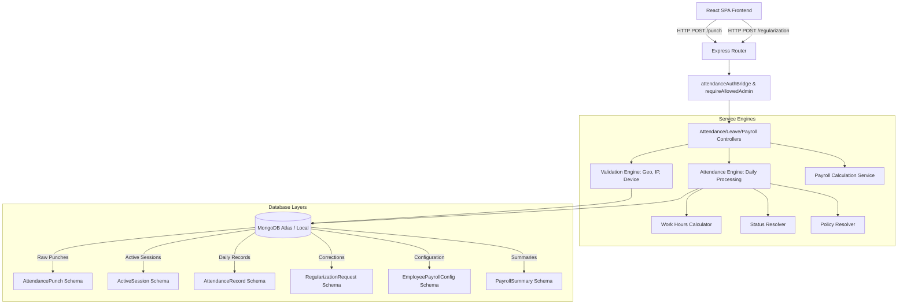
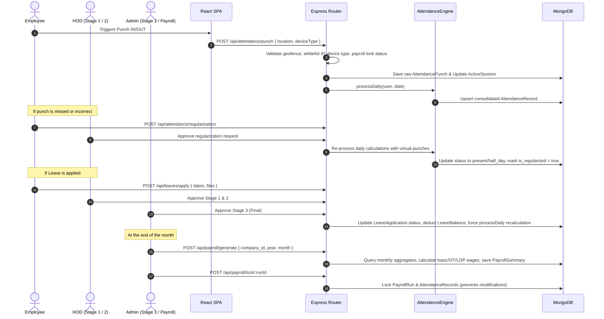
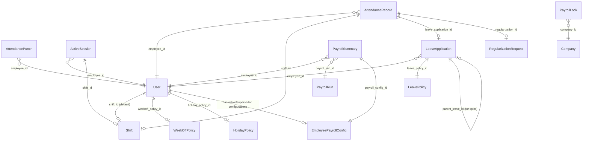

# Attendance & Payroll Management: Complete Developer & KT Guide

Welcome to the **Attendance, Leave, Shift, Overtime, and Payroll Management** system documentation. This document is a comprehensive Knowledge Transfer (KT) guide designed to enable any incoming developer to understand, configure, deploy, maintain, debug, and extend this core module without requiring manual KT sessions.

---

## 1. Project Overview & Architecture

The Attendance & Payroll Management system is a mission-critical module of the AlVision Exim monorepo. It replaces legacy Excel-based manual tracking with an automated, geo-fenced, policy-driven processing engine.

### High-Level System Architecture

The module utilizes a decoupled, layered architecture to isolate raw event ingestion (punches) from policy resolution, daily calculations, correction requests, and payroll summaries.



### Decoupling Pattern

1. **Raw Event Ingestion (Punches)**: Collects instant coordinates, timestamps, and network IPs. There is no evaluation of status here; punches are simply logged to [AttendancePunch](file:///C:/Users/india/Desktop/Projects/eximdev/server/model/attendance/AttendancePunch.js) and [ActiveSession](file:///C:/Users/india/Desktop/Projects/eximdev/server/model/attendance/ActiveSession.js).
2. **Rule Evaluation (Daily Processing)**: Triggered reactively after punches or scheduled by a cron job. The [AttendanceEngine](file:///C:/Users/india/Desktop/Projects/eximdev/server/services/attendance/AttendanceEngine.js) compiles punches, evaluates shifts/holidays, and updates the consolidated [AttendanceRecord](file:///C:/Users/india/Desktop/Projects/eximdev/server/model/attendance/AttendanceRecord.js).
3. **Correction & Workflows (Regularization & Leaves)**: Enables employees to request adjustments. Once HOD or Admin approves, the engine generates virtual punches and forces recalculation.
4. **Payroll Aggregation**: The [PayrollCalculationService](file:///C:/Users/india/Desktop/Projects/eximdev/server/services/payroll/payrollCalculation.service.js) compiles the daily records for a given month, evaluates employee salary configurations, and outputs financial statements without modifying the historical daily logs.

---

## 2. Module Overview

The system is composed of the following interconnected modules:

| Module                       | Core Functionality                                                                                                                                                                                 | Primary Files                                                                                                                                                                                                                                                                                                                                                                      |
| ---------------------------- | -------------------------------------------------------------------------------------------------------------------------------------------------------------------------------------------------- | ---------------------------------------------------------------------------------------------------------------------------------------------------------------------------------------------------------------------------------------------------------------------------------------------------------------------------------------------------------------------------------- |
| **Ingestion Engine**   | Handles clock-in/out, coordinates validation, device restrictions, IP whitelist matches, and updates real-time user status.                                                                        | [attendance.controller.js](file:///C:/Users/india/Desktop/Projects/eximdev/server/controllers/attendance/attendance.controller.js), [ValidationEngine.js](file:///C:/Users/india/Desktop/Projects/eximdev/server/services/attendance/ValidationEngine.js)                                                                                                                            |
| **Shift Management**   | Defines working bounds, buffers for late arrivals/early exits, shift thresholds, operations-specific hours, and cross-day (night) configurations.                                                  | [Shift.js](file:///C:/Users/india/Desktop/Projects/eximdev/server/model/attendance/Shift.js), [WorkHoursCalculator.js](file:///C:/Users/india/Desktop/Projects/eximdev/server/services/attendance/WorkHoursCalculator.js)                                                                                                                                                            |
| **Policy Resolution**  | Resolves dynamic assignments of shifts, week-offs, and holidays based on a hierarchy: (1) Explicit User Override, (2) Team Specifics, (3) Department/Branch Specifics, (4) Company-wide Fallbacks. | [PolicyResolver.js](file:///C:/Users/india/Desktop/Projects/eximdev/server/services/attendance/PolicyResolver.js), [WeekOffPolicy.js](file:///C:/Users/india/Desktop/Projects/eximdev/server/model/attendance/WeekOffPolicy.js), [HolidayPolicy.js](file:///C:/Users/india/Desktop/Projects/eximdev/server/model/attendance/HolidayPolicy.js)                                         |
| **Leave Management**   | Manages application processes, attachments, multi-stage approval chains (Stage 1 HOD, Stage 2 Shalini, Stage 3 Final), partial cancellations (split ranges), and balance refunds.                  | [leave.controller.js](file:///C:/Users/india/Desktop/Projects/eximdev/server/controllers/attendance/leave.controller.js), [LeaveCalculationService.js](file:///C:/Users/india/Desktop/Projects/eximdev/server/services/attendance/LeaveCalculationService.js)                                                                                                                        |
| **Regularization**     | Resolves missed punches or raw log anomalies. Replaces actual punches with virtual ones to compute corrected work durations.                                                                       | [REGULARIZATION_API.md](file:///C:/Users/india/Desktop/Projects/eximdev/server/routes/attendance/REGULARIZATION_API.md), [HOD.controller.js](file:///C:/Users/india/Desktop/Projects/eximdev/server/controllers/attendance/HOD.controller.js)                                                                                                                                        |
| **Payroll Processing** | Tallies monthly attendance counts, applies operators vs management configurations, deducts Loss-of-Pay (LOP), calculates overtime amounts, and generates locks to prevent retro-active changes.    | [payrollCalculation.service.js](file:///C:/Users/india/Desktop/Projects/eximdev/server/services/payroll/payrollCalculation.service.js), [PayrollEngine.js](file:///C:/Users/india/Desktop/Projects/eximdev/server/services/attendance/PayrollEngine.js), [payroll.controller.js](file:///C:/Users/india/Desktop/Projects/eximdev/server/controllers/attendance/payroll.controller.js) |

---

## 3. Complete End-to-End Workflow

A complete workflow sequence details how data traverses from a physical punch to a processed payroll entry:



---

## 4. Business Rules & Assumptions

1. **Hierarchy of Status Overrides**:
   When resolving the status of an employee for any given date, the engine evaluates rules in this strict order:
   $$
   \text{Approved Leave} \rightarrow \text{Public Holiday} \rightarrow \text{Weekly Off} \rightarrow \text{Calculated Attendance Status}
   $$
2. **Loss of Pay (LOP)**:
   Any working day defined by the resolved policy that does not have a corresponding status of `present`, `half_day` (counts as 0.5 present, 0.5 LOP), `leave`, `on_duty`, or configured paid off/holiday is treated as Loss of Pay.
3. **Cutoffs and Locks**:
   - Monthly payroll locking prohibits *any* creation, update, deletion, or regularization of attendance records on or before that month.
   - Leave cancellation has a hardcoded employee cutoff of 30 days. Leaves starting earlier cannot be self-cancelled.
4. **Operations Overrides**:
   Operations shifts have extended requirements compared to management positions to reflect warehouse and field schedules.
5. **GPS Precision**:
   The system assumes GPS coordinates might fluctuate due to building structures. An accuracy buffer is always applied.

---

## 5. API Integration Flow

This section details the critical endpoints, their payloads, sequences, and logic.

### 5.1 Punch Ingestion

* **Endpoint**: `POST /api/attendance/punch`
* **Headers**: Requires cookie `token` (verified by [attendanceAuthBridge](file:///C:/Users/india/Desktop/Projects/eximdev/server/middleware/attendanceAuthBridge.mjs)).
* **Payload Request**:
  ```json
  {
    "type": "IN", 
    "location": {
      "latitude": 19.0760,
      "longitude": 72.8777,
      "accuracy_meters": 15.4
    },
    "deviceType": "mobile"
  }
  ```
* **Process Sequence & Validation Details**:
  1. Bridge extracts user, resolves company, and verifies that the payroll month is not locked via `PayrollEngine.isLocked()`.
  2. Evaluates [ValidationEngine.validatePunch()](file:///C:/Users/india/Desktop/Projects/eximdev/server/services/attendance/ValidationEngine.js):
     - Blocks punch if `user.attendance_settings.punch_allowed === false`.
     - Validates device type. If user has explicit `punch_methods` set, verifies inclusions. Else checks company-wide switches (`allow_mobile_punch` / `allow_web_punch`).
     - Checks IP restriction if enabled.
     - Calculates geofence boundaries (Haversine formula). User must be within `effectiveRadius` (base radius + GPS buffer, capped at 150m).
     - If distance is within the 250m warning zone, allows check-in but returns a `location_warning`. If outside, returns `403 Forbidden`.
  3. Detects active sessions in [ActiveSession](file:///C:/Users/india/Desktop/Projects/eximdev/server/model/attendance/ActiveSession.js):
     - If `type === "IN"` and active session already exists:
       - If elapsed hours $\ge 18$ hours (hardcoded constant), auto-marks previous session as `abandoned` with reason `timeout_18h` and allows a new check-in.
       - Otherwise, returns `400 Bad Request`.
     - If `type === "OUT"` and no active session exists: returns `400 Bad Request`.
  4. Saves [AttendancePunch](file:///C:/Users/india/Desktop/Projects/eximdev/server/model/attendance/AttendancePunch.js). Updates or creates [ActiveSession](file:///C:/Users/india/Desktop/Projects/eximdev/server/model/attendance/ActiveSession.js).
  5. Invokes [AttendanceEngine.processDaily()](file:///C:/Users/india/Desktop/Projects/eximdev/server/services/attendance/AttendanceEngine.js) for the target date to compile raw metrics and update the consolidated [AttendanceRecord](file:///C:/Users/india/Desktop/Projects/eximdev/server/model/attendance/AttendanceRecord.js).
  6. Updates user's real-time flag `current_status` to `in_office` or `out_office`.

---

## 6. Database Models & Schema Relationships

The following entity-relationship diagram maps out how attendance-related schemas associate in MongoDB:



### Core Schema Fields & Indexing Strategies

#### 1. [AttendanceRecord](file:///C:/Users/india/Desktop/Projects/eximdev/server/model/attendance/AttendanceRecord.js)

Stores aggregated daily metrics.

* **Fields**: `employee_id`, `company_id`, `shift_id`, `attendance_date` (UTC Midnight), `attendance_date_str` ("YYYY-MM-DD"), `status` (Enum), `total_work_hours`, `net_work_hours`, `is_late`, `late_by_minutes`, `is_early_exit`, `early_exit_minutes`, `overtime_hours`, `regular_hours` (capped at shift max), `payroll_processed` (Boolean).
* **Indexes**:
  - `{ employee_id: 1, attendance_date: 1 }` (Unique)
  - `{ employee_id: 1, attendance_date_str: 1 }` (Unique)
  - `{ company_id: 1, year_month: 1 }`

#### 2. [LeaveApplication](file:///C:/Users/india/Desktop/Projects/eximdev/server/model/attendance/LeaveApplication.js)

Tracks employee leave requests, approval chains, and splits.

* **Fields**: `employee_id`, `leave_type` (e.g., CL, SL, PL, LWP), `from_date_str`, `to_date_str`, `total_days`, `approval_status` (Enum), `approval_stage` (Enum), `approval_chain` (Array of actions at level 1, 2, and 3), `sandwich_dates` (Array of dates), `sandwich_days_count`, `is_partial_cancellation` (Boolean), `parent_leave_id`.
* **Indexes**: `{ employee_id: 1, from_date_str: 1 }`, `{ company_id: 1, approval_status: 1 }`.

#### 3. [ActiveSession](file:///C:/Users/india/Desktop/Projects/eximdev/server/model/attendance/ActiveSession.js)

Bridges IN and OUT punches statefully.

* **Fields**: `employee_id`, `company_id`, `punch_in_time`, `punch_out_time`, `session_status` (`active`, `closed`, `abandoned`), `expected_out_time`.
* **Index**: `{ employee_id: 1, session_status: 1 }`.

#### 4. [EmployeePayrollConfig](file:///C:/Users/india/Desktop/Projects/eximdev/server/model/attendance/EmployeePayrollConfig.js)

Compensation configuration mapping.

* **Fields**: `employee_id`, `is_operator` (Boolean), `payroll_type` (`MONTHLY`, `DAILY_WAGE`), `monthly_salary`, `daily_wage`, `overtime_eligible`, `overtime_rate_per_hour`, `overtime_grace_minutes`, `status` (`ACTIVE`, `SUPERSEDED`, `INACTIVE`), `effective_from`, `effective_to`.
* **Index**: Unique index on `{ employee_id: 1, status: 1 }` filtered on partial expression `{ status: 'ACTIVE' }`.

---

## 7. Math & Business Logic Calculations

### 7.1 Daily Work Hours & Late/Early Resolution

Handled inside [WorkHoursCalculator](file:///C:/Users/india/Desktop/Projects/eximdev/server/services/attendance/WorkHoursCalculator.js) and [AttendanceEngine](file:///C:/Users/india/Desktop/Projects/eximdev/server/services/attendance/AttendanceEngine.js).

#### 1. Work Session Duration

For each valid session (an IN punch followed by an OUT punch):

$$
\text{Session Duration (Hours)} = \frac{\text{Punch Out Time} - \text{Punch In Time}}{1000 \times 60 \times 60}
$$

#### 2. Late Arrival calculation

Let $T_{in}$ be the first punch-in time converted to minutes of day, $T_{start}$ be the scheduled shift start time in minutes, and $B_{late}$ be the allowed late grace buffer (in minutes).

$$
\text{isLate} = T_{in} > (T_{start} + B_{late})
$$

$$
\text{lateMinutes} = \begin{cases} T_{in} - T_{start} & \text{if isLate} \\ 0 & \text{otherwise} \end{cases}
$$

*Note: Once the buffer $B_{late}$ is exceeded, late minutes are calculated from the actual shift start $T_{start}$, not from the buffer threshold.*

#### 3. Early Exit calculation

Let $T_{out}$ be the last punch-out time normalized to the nearest day in minutes of day, $T_{end}$ be the scheduled shift end time, and $B_{early}$ be the allowed early leave buffer.

$$
\text{isEarlyExit} = T_{out} < (T_{end} - B_{early})
$$

$$
\text{earlyExitMinutes} = \begin{cases} \min(T_{end} - T_{out}, 720) & \text{if isEarlyExit} \\ 0 & \text{otherwise} \end{cases}
$$

#### 🎯 Numerical Example (Work Hours & Late/Early)

* **Shift Settings**: Start = `09:00` (540m), End = `18:00` (1080m), Late Buffer = `15 mins`, Early Buffer = `10 mins`.
* **Employee Punches**: IN at `09:20` (560m), OUT at `17:45` (1065m).
* **Calculations**:
  - $T_{in} = 560$ min. Threshold = $540 + 15 = 555$ min.
  - Since $560 > 555$: $\text{isLate} = \text{true}$.
  - $\text{lateMinutes} = 560 - 540 = 20 \text{ minutes}$.
  - $T_{out} = 1065$ min. Threshold = $1080 - 10 = 1070$ min.
  - Since $1065 < 1070$: $\text{isEarlyExit} = \text{true}$.
  - $\text{earlyExitMinutes} = 1080 - 1065 = 15 \text{ minutes}$.
  - $\text{Total Work Hours} = \frac{17:45 - 09:20}{1 \text{ hour}} = \frac{505 \text{ mins}}{60} = 8.42 \text{ hours}$.

---

### 7.2 Leave Calculation & Sandwich Policy

Handled inside [LeaveCalculationService](file:///C:/Users/india/Desktop/Projects/eximdev/server/services/attendance/LeaveCalculationService.js).

#### 1. Sandwich Policy Formula

Under sandwich policies, intervening non-working days (week-offs or holidays) inside or adjacent to a leave range are deducted as leaves if they are bracketed by absences on the nearest working days.

Let $R$ be the date range $[D_{start}, D_{end}]$ of a leave application. For any day $d \in R$:

$$
\text{isSandwiched}(d) = \text{isNonWorking}(d) \land \text{absent}(D_{left}) \land \text{absent}(D_{right})
$$

Where:

- $D_{left}$ is the nearest working day index moving backward from $d$. If within range $R$, evaluated by daily record. If outside $R$, resolved by checking `boundaryContext.before`.
- $D_{right}$ is the nearest working day index moving forward from $d$. If within range $R$, evaluated by daily record. If outside $R$, resolved by checking `boundaryContext.after`.
- $\text{absent}(D)$ means the employee did not work on day $D$ (evaluated as: worked hours < presence threshold, default 4 hours).

If $\text{isSandwiched}(d)$ is true, 1.0 day is added to `sandwich_days` and deducted from the balance.

#### 🎯 Numerical Example (Sandwich Policy)

* **Calendar Context**: Friday (Working), Saturday (Weekly Off), Sunday (Weekly Off), Monday (Working).
* **Leave Application**: Leave requested from Friday to Monday (4 calendar days).
* **Work Records**: Employee is absent Friday and absent Monday.
* **Calculations**:
  - Saturday and Sunday are non-working days in the range.
  - Nearest working day left of Saturday is Friday (Absent).
  - Nearest working day right of Saturday is Monday (Absent).
  - Both Saturday and Sunday are bracketed by absences.
  - **Result**: Sandwich Days = 2, Working Leave Days = 2. Total Deducted Days = 4 (instead of 2 working days).

---

### 7.3 Overtime Calculation

Handled inside [WorkHoursCalculator](file:///C:/Users/india/Desktop/Projects/eximdev/server/services/attendance/WorkHoursCalculator.js) and [payrollCalculation.service.js](file:///C:/Users/india/Desktop/Projects/eximdev/server/services/payroll/payrollCalculation.service.js).

#### 1. Daily Ingestion Calculation (Raw Overtime)

Let $H_{net}$ be the net worked hours, $H_{shift}$ be the shift requirement (default 8 hours), and $M_{grace}$ be the overtime grace buffer in minutes (default 20 minutes).

$$
\text{Overtime Hours (Daily)} = \begin{cases} \text{Round}\left(\frac{H_{net} \times 60 - H_{shift} \times 60}{60}, 2\right) & \text{if } H_{net} \times 60 > (H_{shift} \times 60 + M_{grace}) \\ 0 & \text{otherwise} \end{cases}
$$

#### 2. Payroll Generation Calculation (Approved Overtime)

* **Operators**: Overtime is automatically approved.
* **Management**: Requires explicit flag `overtime_approved = true` on the daily [AttendanceRecord](file:///C:/Users/india/Desktop/Projects/eximdev/server/model/attendance/AttendanceRecord.js).

---

### 7.4 Monthly Payroll Calculations

Handled inside [payrollCalculation.service.js](file:///C:/Users/india/Desktop/Projects/eximdev/server/services/payroll/payrollCalculation.service.js) and [PayrollEngine](file:///C:/Users/india/Desktop/Projects/eximdev/server/services/attendance/PayrollEngine.js).

#### 1. Payable Days

$$
\text{Payable Days} = \text{Present Days} + (\text{Half-Days} \times 0.5) + \text{Weekly Offs} + \text{Holidays} + \text{Paid Leaves}
$$

*Note: Weekly Offs and Holidays are included in payroll configurations based on the company's `include_weekly_offs_in_payable` and `include_holidays_in_payable` parameters.*

#### 2. Loss of Pay (LOP) Days

$$
\text{LOP Days} = \text{Total Working Days in Period} - (\text{Present Days} + \text{Paid Leaves} + \text{Half-Days} \times 0.5)
$$

#### 3. Wages Resolution

* **DAILY_WAGE (Operators)**:

  $$
  \text{Basic Wages} = \text{Payable Days} \times \text{Daily Wage Rate}
  $$

  $$
  \text{OT Amount} = \text{Total Approved OT Hours} \times \text{OT Hourly Rate}
  $$

  *Where:* $\text{OT Hourly Rate} = \frac{\text{Daily Wage Rate}}{8}$ (unless overwritten by explicit config).
* **MONTHLY (Management)**:

  $$
  \text{Basic Wages} = \frac{\text{Payable Days}}{\text{Total Days in Month}} \times \text{Monthly Salary}
  $$

  $$
  \text{LOP Deduction} = \text{LOP Days} \times \frac{\text{Monthly Salary}}{\text{Basis}}
  $$

  *Where $\text{Basis}$ is determined by company policy: Calendar Days (e.g. 30/31) or Working Days.*

#### 🎯 Numerical Example (Monthly Payroll)

* **Employee Profile**: Management, Monthly Salary = `₹30,000`. LOP Basis = `Calendar Days`.
* **Month Summary**: June (30 days, 22 Working Days, 8 Week-offs).
* **Attendance Stats**: Present = 20 days, Half-Day = 2 days, Absent = 0 days, Week-off = 8 days.
* **Calculations**:
  - $\text{Payable Days} = 20 \text (Present) + (2 \times 0.5) \text{ (Half-days)} + 8 \text{ (Week-off)} = 29 \text{ days}$.
  - $\text{LOP Days} = 22 \text{ (Working Days)} - [20 + 2 \times 0.5] = 1 \text{ day}$.
  - $\text{Per Day Salary} = \frac{₹30,000}{30} = ₹1,000$.
  - $\text{LOP Deduction} = 1 \text{ LOP} \times ₹1,000 = ₹1,000$.
  - $\text{Net Payable} = ₹30,000 - ₹1,000 = ₹29,000$.

---

## 8. Validations & Data Integrity Rules

1. **Active Session Ordering**:
   The system prevents corrupt check-ins by enforcing session integrity:

   - An `IN` punch creates an active session. A subsequent `IN` punch is blocked unless the previous session exceeds the timeout limit.
   - An `OUT` punch closes the active session.
2. **GPS Accuracy Buffer Cap**:
   Validation checks capture GPS accuracy (in meters) reported by the device browser. If the accuracy is poor, the system buffers the geofencing radius:

   $$
   \text{Buffer} = \min(\text{gpsAccuracyMeters}, 150)
   $$

   $$
   \text{Allowed Radius} = \text{Nominal Radius} + \text{Buffer}
   $$

   *This stops weather or building interference from blocking punches.*
3. **Payroll Lock Protection**:
   Before executing mutations on `AttendancePunch`, `RegularizationRequest`, or `LeaveApplication`, the system verifies `PayrollEngine.isLocked()`. If a lock exists, the API halts write execution and returns `403 Forbidden`.

---

## 9. Edge Cases & Special Scenarios Handled

1. **Midnight (Cross-Day) Shifts**:
   Resolved automatically in [AttendanceEngine](file:///C:/Users/india/Desktop/Projects/eximdev/server/services/attendance/AttendanceEngine.js) when a shift's scheduled `end_time` is chronologically before or equal to `start_time` (e.g. `22:00` to `06:00`). The engine widens the query range to check the next calendar day's punches, mapping the matching morning OUT punch to the previous date's attendance record.
2. **Auto-Abandon Timeout**:
   Punched-in sessions that remain open for longer than the limits are flagged as stale. A background cron job checks active sessions:
   - If the duration exceeds `12 hours` (defined in [app.mjs](file:///C:/Users/india/Desktop/Projects/eximdev/server/app.mjs)), the session is updated to `session_status = "abandoned"` with reason `timeout_12h`. The daily record status is updated to `incomplete` (missed punch).
3. **Grace Window for Absences**:
   To prevent the daily automated engines from marking active employees as absent early in the morning, the engine checks:
   $$
   \text{Current Time} < \text{Shift Start} + 4 \text{ hours}
   $$

   If true, the system skips writing an `absent` record, allowing the employee time to report late or apply for leaves.
4. **Operations Threshold Overrides**:
   Any shift containing the keyword `"operation"` (case-insensitive) bypasses normal company thresholds and enforces:
   - **Full Day**: 8.3 worked hours (instead of 8.0).
   - **Half Day**: 4.15 worked hours (instead of 4.0).
5. **Leave Split Cancellation**:
   If an employee cancels a sub-range of an already approved leave block, the controller duplicates the application. The cancelled sub-range is saved as `is_partial_cancellation = true` with status `cancelled`, while the remainder dates are split into a new active leave document linked via `parent_leave_id`.

---

## 10. Folder Structure & Code Organization

The attendance and payroll modules are cleanly organized within both the backend and frontend paths:

```
eximdev/
├── client/                                 # React SPA Frontend
│   └── src/
│       └── components/
│           └── attendance/                 # Attendance & Leave UI
│               ├── admin/                  # Administrative configurations
│               │   ├── AdminDashboard_Enterprise.jsx  # Main enterprise panel
│               │   ├── AdminAnalyticsTab.jsx          # Graphs and trends
│               │   └── AdminMonthlySummaryTab.jsx     # Aggregated month tables
│               ├── common/                 # Reusable modals and segments
│               ├── ApplyLeaveModal.jsx     # Leave request form
│               ├── Attendance.jsx          # Employee punch screen
│               ├── AttendanceReport.jsx    # Historical reports & grids
│               ├── Dashboard.jsx           # Employee overview dashboard
│               └── LeaveManagement.jsx     # Leave tracking & requests list
│
└── server/                                 # Express Backend
    ├── controllers/
    │   └── attendance/                     # Core Business Logic Handlers
    │       ├── attendance.controller.js    # Ingestion, punches, admin overrides
    │       ├── HOD.controller.js           # Multi-stage approvals, team data
    │       ├── leave.controller.js         # Leave balances, splits, applications
    │       ├── payroll.controller.js       # Configurations, summaries, wage run
    │       └── policy.controller.js        # Shifts, week-offs, holidays CRUD
    │
    ├── model/
    │   └── attendance/                     # Mongoose Schemas (ES modules)
    │       ├── ActiveSession.js            # Stateful punch sessions
    │       ├── AttendancePunch.js          # Raw check-in logs
    │       ├── AttendanceRecord.js         # Consolidated daily logs
    │       ├── CompOffRecord.js            # Earned comp-offs
    │       ├── EmployeePayrollConfig.js    # Wage parameters & operator flags
    │       ├── HolidayPolicy.js            # Holiday calendar rules
    │       ├── LeaveApplication.js         # Leave requests and stages
    │       ├── PayrollRun.js               # Locked/Draft payroll batches
    │       ├── PayrollSummary.js           # Consolidated monthly salary sheet
    │       └── WeekOffPolicy.js            # Week-off calendars
    │
    ├── routes/
    │   └── attendance/                     # Express Endpoint Mounting
    │       ├── attendanceRoutes.mjs        # Core employee routes
    │       ├── leaveRoutes.mjs             # Leave applications
    │       ├── hodRoutes.mjs               # Management approvals
    │       ├── masterRoutes.mjs            # Shift/holiday CRUD
    │       └── payrollRoutes.mjs           # Generating/locking payroll runs
    │
    └── services/
        ├── attendance/                     # Logic Processing Libraries
        │   ├── AggregationService.js       # Cache-backed multi-level summaries
        │   ├── AttendanceEngine.js         # Daily status & buffer processing
        │   ├── AttendanceStatusResolver.js # Resolves present/absent categories
        │   ├── LeaveCalculationService.js  # Deductions and sandwich resolution
        │   ├── PolicyResolver.js           # Active shift/holiday selectors
        │   ├── ValidationEngine.js         # Geo-fencing & device check
        │   └── WorkHoursCalculator.js      # Session durations, late calculations
        └── payroll/
            ├── payrollCalculation.service.js # Tallying months and wage calculations
            └── payrollLock.service.js      # Audit locks
```

---

## 11. Configuration & Setup Instructions

### Environment Variables

Configure the following variables in `server/.env`:

* `PORT` — Port number the backend server binds to (default: `9006`).
* `DEV_MONGODB_URI` — Connection string to local development MongoDB (e.g., `mongodb://localhost:27017/exim`).
* `PROD_MONGODB_URI` — Connection string to MongoDB Atlas production cluster.
* `JWT_SECRET` — Secret string used for signing cookies tokens.
* `DISABLE_CLUSTER` — Set to `true` to run single-threaded processes (e.g., during debugger runs or local tests).

### Local Development Quickstart

1. **Database Setup**: Ensure local MongoDB instance is active.
2. **Backend Setup**:
   ```bash
   cd server
   npm install
   # Create server/.env and define DEV_MONGODB_URI and JWT_SECRET
   npm start
   ```
3. **Frontend Setup**:
   ```bash
   cd client
   npm install
   # Create client/.env and define REACT_APP_API_STRING=http://localhost:9006
   npm start
   ```

---

## 12. Cron Jobs & Background Processes

Scheduled tasks are registered in [app.mjs](file:///C:/Users/india/Desktop/Projects/eximdev/server/app.mjs) and run exclusively on the primary cluster thread (`cluster.worker.id === 1`) to avoid duplicate execution:

1. **Auto-Mark Stale Sessions**:
   * **Schedule**: `*/15 * * * *` (Every 15 minutes in IST).
   * **Target**: Find documents in `ActiveSession` with `status: "active"` where `punch_in_time` is older than 12 hours.
   * **Action**: Abandon sessions, mark daily attendance status as `incomplete` with reason `timeout_12h`.
2. **Currency Rate Scraper**:
   * **Schedule**: `1 0 * * *` (Daily at 12:01 AM IST).
   * **Action**: Invokes currency scraper to fetch conversion rates.

---

## 13. Roles, Permissions & Authorization Flow

The application maps authentication from the monorepo framework into the attendance context:

```
[EXIM Client Cookie] 
        │
        ▼ (attendanceAuthBridge)
  Checks token validity, fetches fresh database record
        │
        ▼ (mapRole)
  Maps Roles: "Admin"              → "ADMIN"
             "Head_of_Department" → "HOD"
             "All others"         → "EMPLOYEE"
```

### Authorization Categories

1. **Super Admins**:
   Can read and mutate all resources. System checks for explicit usernames:
   `['shalini_arun', 'manu_pillai', 'suraj_rajan', 'rajan_aranamkatte', 'uday_zope']`.
2. **HOD (Heads of Department)**:
   Authorized to read and approve leaves and regularizations for employees belonging to the teams they manage. A user is resolved as HOD for an employee if:
   - The user is the designated `hodId` of the employee's team.
   - The user is a member of the employee's team and has the role of `HOD` or `HeadOfDepartment`.
3. **Allowed Admins (Dynamic)**:
   Users with the database flag `isAttendanceAllowedAdmin === true`.
   - **Unrestricted**: Have global admin access across all branches.
   - **Restricted**: Scoped to view and process configurations/payroll only for members of their own teams.
   - **Special Exception (Ajith)**: The username `ajith_sivadasan` is restricted but gets extended privileges to manage all employees under `"RABS Industries India Private Limited"`.

---

## 14. Common Troubleshooting & Debugging Tips

* **Issue: "Company not found" error during check-in**:
  * *Reason*: The employee document has a legacy plain string for company, but `company_id` (ObjectId) is missing.
  * *Fix*: The [attendanceAuthBridge](file:///C:/Users/india/Desktop/Projects/eximdev/server/middleware/attendanceAuthBridge.mjs) runs `resolveLegacyCompany` which auto-updates the schema. If it fails, check if the Company collection contains a match for the spelling of the company field.
* **Issue: Employee punches IN, but status immediately becomes Absent**:
  * *Reason*: Daily calculations are processed dynamically. If it is early in the morning and they haven't worked past the half-day threshold, they may momentarily appear absent.
  * *Fix*: Ensure the UI distinguishes between processed "Live" calculations and closed shifts.
* **Issue: Geofencing fails inside offices**:
  * *Reason*: High-precision GPS is limited indoors.
  * *Fix*: Look at the validation logs. The system applies the browser reported accuracy buffer. If accuracy is poor, verify that the company's nominal radius has an adequate range (e.g. 200m).

---

## 15. Performance Considerations & Caching

1. **Cache Layer**:
   The [AggregationService](file:///C:/Users/india/Desktop/Projects/eximdev/server/services/attendance/AggregationService.js) uses a memory-backed cache map (`Map`) to store aggregate statistics for admin dashboards:
   - `globalSummary`: 5-minute TTL.
   - `monthlySummary`: 1-hour TTL.
   - `leaveRequests` & `regularizationRequests`: 5-minute TTL.
     Cache entries are keyed by normalized filters (arrays of organization/department/team IDs).
2. **Atlas Connection Limits**:
   MongoDB client settings are tuned to:
   - `maxPoolSize: 30` to prevent connection exhaustion across cluster worker nodes.
   - `minPoolSize: 0` to release connections when processes go idle.

---

## 16. Technical Debt & Future Improvements

1. **Database-Driven Workflows**:
   The leave approval stages are hardcoded around Stage 1 (HOD), Stage 2 (Shalini), and Stage 3 (Final). This should be migrated to a configurable database table to support custom corporate workflows.
2. **Consolidation of Constants**:
   The timeout limit for missed punches must be consolidated into a unified configuration.
3. **Decouple Username Arrays**:
   Access controls checking explicit strings (e.g. `ajith_sivadasan`, `shalini_arun`) should be migrated into dynamic Mongoose permissions schemas.

---

## 17. Known Limitations

* **Timeout Discrepancy**: Standard automatic cron checks abandon sessions after 12 hours of inactivity, whereas the manual punch controllers allow check-in overrides only after 18 hours. This can lead to a 6-hour window where the record status and active session status mismatch before a new IN punch.
* **Leave Splits**: Splitting is proportional to calendar days. It does not consider holiday weightings during the split calculation, which may lead to fractional leaves being deducted when splitting adjacent holidays.

---

## 18. Hardcoded Constants Audit & Config Guidelines

The following table documents all hardcoded elements in the system that should be migrated to configurations:

| Constant / Code Element                                  | Location                                                                                                                                                                                                | Purpose                                                     | Reason                                      | Proposed Refactoring                                                                                                         |
| -------------------------------------------------------- | ------------------------------------------------------------------------------------------------------------------------------------------------------------------------------------------------------- | ----------------------------------------------------------- | ------------------------------------------- | ---------------------------------------------------------------------------------------------------------------------------- |
| `STAGE_2_APPROVER_USERNAME = 'shalini_arun'`           | [HOD.controller.js](file:///C:/Users/india/Desktop/Projects/eximdev/server/controllers/attendance/HOD.controller.js#L27)                                                                                 | Defines the Stage 2 Leave Approver.                         | Explicit request for Stage 2 processing.    | Add`leave_approver_stage_2` (ObjectId reference to User) inside the `Company` schema.                                    |
| `FINAL_APPROVER_USERNAMES = ['manu_pillai', ...]`      | [HOD.controller.js](file:///C:/Users/india/Desktop/Projects/eximdev/server/controllers/attendance/HOD.controller.js#L28)                                                                                 | Defines the final Stage 3 Approvers.                        | Corporate hierarchy limits final approvals. | Create a`User` role category or add a flag `isLeaveFinalApprover: true` inside the User model.                           |
| `ALLOWED_USERNAMES`                                    | [requireAllowedAdmin.mjs](file:///C:/Users/india/Desktop/Projects/eximdev/server/middleware/requireAllowedAdmin.mjs#L2)                                                                                  | Allowlist of admins for attendance dashboard access.        | Security restriction to limit access.       | Leverage user attributes by utilizing the existing`isAttendanceAllowedAdmin` boolean flag instead.                         |
| `CUTOFF_DAYS = 30`                                     | [leave.controller.js](file:///C:/Users/india/Desktop/Projects/eximdev/server/controllers/attendance/leave.controller.js#L1452)                                                                           | Restricts self-cancellation of leaves to the last 30 days.  | Avoid modifications to past attendance.     | Store`leave_cancellation_cutoff_days` inside the `Company` settings sub-document.                                        |
| `MISSED_PUNCH_LIMIT_HOURS = 18`                        | [attendance.controller.js](file:///C:/Users/india/Desktop/Projects/eximdev/server/controllers/attendance/attendance.controller.js#L217)                                                                  | Threshold to force close check-ins when punching IN.        | Enforce session borders.                    | Create a unified`missed_punch_timeout_hours` inside the `Company` or `Shift` schema.                                   |
| `MISSED_PUNCH_LIMIT_HOURS = 12`                        | [AttendanceEngine.js](file:///C:/Users/india/Desktop/Projects/eximdev/server/services/attendance/AttendanceEngine.js#L8) / [app.mjs](file:///C:/Users/india/Desktop/Projects/eximdev/server/app.mjs#L279) | Threshold for cron abandonment.                             | Automatic stale session cleanup.            | Harmonize with the controller and store under`Company` settings.                                                           |
| `ajith_sivadasan`                                      | [allowedAdminRestriction.mjs](file:///C:/Users/india/Desktop/Projects/eximdev/server/utils/attendance/allowedAdminRestriction.mjs#L28)                                                                   | Grants Ajith management access to all RABS employees.       | Scope override.                             | Add`managed_companies` (Array of Company ObjectIds) inside the `User` schema.                                            |
| `"operation"` shift override (8.3h / 4.15h)            | [AttendanceEngine.js](file:///C:/Users/india/Desktop/Projects/eximdev/server/services/attendance/AttendanceEngine.js#L184)                                                                               | Sets special work duration thresholds for operations teams. | Specific shift requirement.                 | Leverage the`full_day_hours` and `half_day_hours` fields of the `Shift` model itself rather than matching shift names. |
| `gpsAccuracyMeters` buffer (150m cap) / warning (250m) | [ValidationEngine.js](file:///C:/Users/india/Desktop/Projects/eximdev/server/services/attendance/ValidationEngine.js#L97-L99)                                                                            | Extends geo radius to accommodate poor signal warnings.     | GPS drift drift compensation.               | Store`gps_buffer_limit_meters` and `gps_warning_radius_meters` inside the `Company` settings schema.                   |
