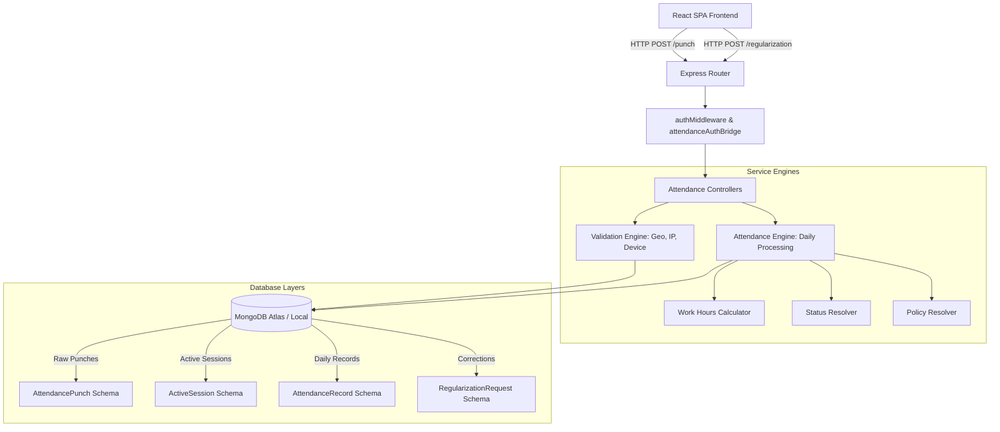
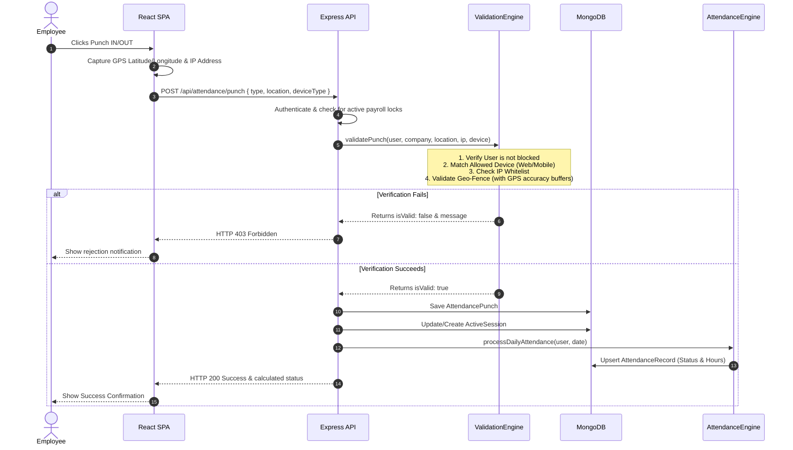
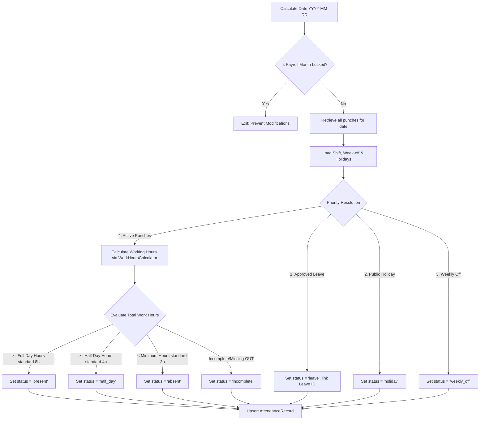
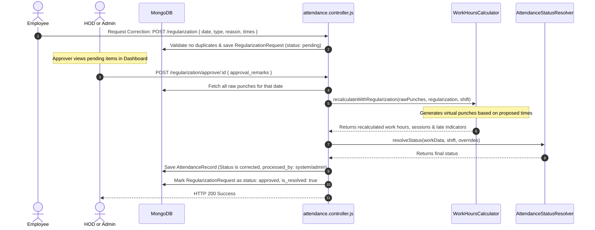

# Attendance Module System Design & Architecture Guide

This guide describes the architecture, database schema, verification logic, and processing lifecycles of the **Attendance and Leave Management System** in AlVision Exim. It is designed to assist engineers in understanding the current state and performing system design for new features.

---

## 1. High-Level System Architecture

The attendance system uses a layered architecture to decouple raw ingestion (punches) from rule evaluation (daily calculation) and correction workflows (regularizations, leaves).



---

## 2. Core Domain Models & Database Schemas

### 2.1 Raw Ingestion & Live State Models
*   **[AttendancePunch](file:///c:/Users/india/Desktop/Projects/eximdev/server/model/attendance/AttendancePunch.js)**: Stores every discrete punch event.
    *   `employee_id` (ObjectId): Refers to the User.
    *   `punch_type` (String): `IN` or `OUT`.
    *   `punch_time` (Date): Actual UTC timestamp of the punch.
    *   `punch_date_str` (String): Local date key `YYYY-MM-DD` for daily grouping.
    *   `punch_method` (String): `web`, `mobile`, or bio-metric source.
*   **[ActiveSession](file:///c:/Users/india/Desktop/Projects/eximdev/server/model/attendance/ActiveSession.js)**: Tracks stateful active shifts to enforce order (IN must precede OUT).
    *   `session_status` (String): `active`, `closed`, `abandoned`.
    *   `punch_in_time` & `punch_out_time` (Date).
    *   `expected_out_time` (Date): Auto-calculated boundary (punch_in_time + 18 hours).

### 2.2 Compilation & Aggregate Models
*   **[AttendanceRecord](file:///c:/Users/india/Desktop/Projects/eximdev/server/model/attendance/AttendanceRecord.js)**: The consolidated daily sheet containing calculated metrics.
    *   `status` (String): `present`, `absent`, `half_day`, `incomplete`, `leave`, `holiday`, `weekly_off`, `on_duty`.
    *   `total_work_hours` (Number): Sum of all closed sessions on that date.
    *   `work_sessions` (Array): Detailed lists of sub-sessions (punch-in, punch-out, duration).
    *   `is_late`, `late_by_minutes` & `is_early_exit`, `early_exit_minutes`.
    *   `is_half_day`, `half_day_session` (`first_half` / `second_half`).
    *   `is_on_leave`, `leave_application_id` (ObjectId).
    *   `processed_by` (String): `system`, `admin`, `cron`.
*   **[RegularizationRequest](file:///c:/Users/india/Desktop/Projects/eximdev/server/model/attendance/RegularizationRequest.js)**: Request created by an employee to correct an anomaly.
    *   `status` (String): `pending`, `approved`, `rejected`.
    *   `corrected_punch_in_time` & `corrected_punch_out_time` (Date): The proposed correction.
    *   `is_resolved` (Boolean) & `resolution_source` (String): Metadata to identify how the request was resolved (e.g. standard HOD approval or manual administrative adjustment).

---

## 3. Core Operational Workflows

### 3.1 Punch In/Out Ingestion Flow
When an employee clicks "Punch IN/OUT" in the UI:



#### Geo-Fencing & Validation Details
The **[ValidationEngine](file:///c:/Users/india/Desktop/Projects/eximdev/server/services/attendance/ValidationEngine.js)** enforces physical boundaries:
1.  **GPS Accuracy Buffer**: Computes GPS accuracy. If the device reports a poor accuracy radius, the system dynamically expands the effective radius by adding `Math.min(gpsAccuracyMeters, 150)` as a buffer to prevent indoor/weather-related check-in failures.
2.  **Distance Calculation**: Calculates distance using the Haversine formula:
    $$d = 2R \arcsin\left(\sqrt{\sin^2\left(\frac{\Delta \phi}{2}\right) + \cos(\phi_1)\cos(\phi_2)\sin^2\left(\frac{\Delta \lambda}{2}\right)}\right)$$
3.  **Warning Zone**: If a user is slightly outside the boundary (between nominal radius and +250m), the check-in is allowed but flagged as a `location_warning` in the activity log.

---

### 3.2 Daily Calculations & Compilation
The compilation engine runs dynamically on every punch event and is also executed by daily scheduler cron jobs:



#### Custom Corporate Rules
*   **Midnight Shifts**: Cross-day shifts are detected automatically when `end_time <= start_time`. The engine extends the punch retrieval window to include the next calendar day so that matching OUT punches are grouped under the correct session date.
*   **Operations Shift Requirement**: Special override is implemented for shifts with names containing "operation":
    *   **Full Day Requirement**: `8.3 hours` (instead of standard 8.0).
    *   **Half Day Requirement**: `4.15 hours` (instead of standard 4.0).
*   **Absent Grace Window**: Employees are not marked absent for the day until at least **4 hours** have elapsed past the scheduled shift start time.

---

### 3.3 Attendance Correction (Regularization) Workflow
If an employee misses a punch or has an incorrect status, they request a regularization:



#### Regularization Cancellation (UI State Sync)
When a regularization is cancelled, the endpoint **[cancelRegularization](file:///c:/Users/india/Desktop/Projects/eximdev/server/controllers/attendance/attendance.controller.js#L834-L857)** deletes the document. If it is already approved/rejected or deleted elsewhere, it returns `404 Not Found`. The client-side UI handles the 404 by forcing a refresh, ensuring that the regularization dot is cleared from the dashboard immediately.

---

### 3.4 Leave Application & Sandwich Rules
The **[LeaveApplication](file:///c:/Users/india/Desktop/Projects/eximdev/server/model/attendance/LeaveApplication.js)** collection tracks employees' time off:
1.  **Multi-Stage Approvals**: Leaves traverse a multi-stage approval workflow (`stage_1_hod` -> `stage_2_shalini` -> `stage_3_final`) depending on company-level configurations.
2.  **Sandwich Policy**: The **[LeaveCalculationService](file:///c:/Users/india/Desktop/Projects/eximdev/server/services/attendance/LeaveCalculationService.js)** checks if a leave request spans or is bracketed by weekly offs and public holidays. Under sandwich rules, intervening non-working days are deducted from the employee's leave balance.
3.  **Partial/Split Cancellation**: Supports splitting a single approved leave block. If an employee cancels a sub-range of a leave, the record is duplicated into a cancelled sub-range and a split remainder that stays active.

---

## 4. Step-by-Step Guide: Adding a New Feature

If you need to add a new feature (e.g., **Biometric Device Punch Ingestion**, **Geofencing boundaries per Team**, or **Selfie Upload on Web-punch**), follow this workflow:

### Step 1: Database Model Extensions
Define any new attributes in the relevant schema:
*   *Example (Selfie Upload)*: Add `selfie_url` to `AttendancePunch.js`.
*   *Example (Team-specific boundaries)*: Add `allowed_locations` (array of GeoJSON coordinates) to `TeamModel.mjs` or `Shift.js`.

### Step 2: Update the Validation Engine
Add validation rules in **[ValidationEngine.js](file:///c:/Users/india/Desktop/Projects/eximdev/server/services/attendance/ValidationEngine.js)**:
```javascript
static validatePunch(user, company, punchData) {
    // 1. Existing checks (IP, user blocking, device check)
    // 2. Add your new custom check:
    if (company.settings.selfie_required && !punchData.selfie_url) {
        return { isValid: false, message: 'Selfie upload is required to punch in.' };
    }
}
```

### Step 3: Implement API Route & Controller Logic
Create or update routes in **[attendanceRoutes.mjs](file:///c:/Users/india/Desktop/Projects/eximdev/server/routes/attendance/attendanceRoutes.mjs)** and handlers in **[attendance.controller.js](file:///c:/Users/india/Desktop/Projects/eximdev/server/controllers/attendance/attendance.controller.js)**:
*   For file uploads (like selfies), use the configured `multer` middleware on the router.
*   Enforce security roles using the `requireRole(['ADMIN', 'HOD'])` middleware.

### Step 4: Daily Processing Updates (If applicable)
If the new feature affects how work hours are calculated:
*   Modify **[WorkHoursCalculator.js](file:///c:/Users/india/Desktop/Projects/eximdev/server/services/attendance/WorkHoursCalculator.js)** to process the new punch criteria.
*   Update **[AttendanceStatusResolver.js](file:///c:/Users/india/Desktop/Projects/eximdev/server/services/attendance/AttendanceStatusResolver.js)** if new attendance states (e.g., "suspension", "quarantine") are introduced.

### Step 5: Frontend Integration & State Sync
*   **Axios HTTP Client**: Use the default Axios client which passes credentials (cookies) automatically:
    ```javascript
    import api from '../../api'; // global Axios client with withCredentials: true
    ```
*   **UI Calendars**: If adding state tags, update `client/src/components/attendance/Dashboard.jsx` or relevant panels to render the new indicators. Ensure all cancelled or resolved statuses are evaluated to hide correction dots correctly.

---

## 5. Security & Isolation Checkpoints
*   **Authorized Branches**: Ensure non-Admin actors only fetch data for their assigned branch IDs using `req.user.authorizedBranchIds`.
*   **Payroll Lock Protection**: Before writing, modifying, or regularizing any attendance record, verify that the corresponding month's payroll is not locked by calling `PayrollEngine.isLocked(company, yearMonth)`.
